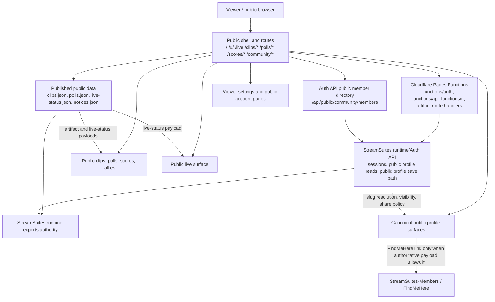

# StreamSuites-Public

Canonical public StreamSuites surface deployed to Cloudflare Pages at `https://streamsuites.app`.

## Release State

- README state prepared for `v0.4.2-alpha`.
- Runtime-displayed version/build labels are consumed at runtime from `https://admin.streamsuites.app/runtime/exports/version.json`.
- This repo is not a canonical state authority. It renders authoritative runtime exports and Auth API responses.

## Scope & Authority

- This repo is the public-facing site shell for profiles, public artifacts, viewer-facing pages, and public live discovery.
- Same-origin Cloudflare Pages Functions proxy browser requests to the authoritative Auth API, but they do not move backend ownership into this repo.
- Canonical slug resolution, profile visibility, share URLs, and FindMeHere eligibility remain runtime/Auth-owned in `StreamSuites`.
- Public routes render authoritative runtime exports and Auth payloads; they do not mint competing profile or live-status truth.

## Repo-Scoped Flowchart



## Current Surface Model

- The public `/media` and `/community` experiences now share one dashboard-style shell and one sidebar/navigation model, with `/media` remaining the default public home tab for the viewer/member dashboard.
- Canonical public profiles resolve at `/u/<slug>`, backed by the authoritative public slug model exported by `StreamSuites`.
- Legacy `user_code` compatibility is still preserved during profile resolution and migration-safe routing.
- Clean public artifact routes are supported for clips, polls, and scores via `/clips/<id-or-slug>`, `/polls/<id-or-slug>`, and `/scores/<id-or-slug>`, while legacy detail entry points remain available.
- `/community/settings.html` is the viewer/public account profile settings surface and loads or saves supported authoritative fields through the public profile API.
- `/community/my-data.html` now reads the signed-in user’s real public-authority request history from the authoritative `/api/public/authority/requests/mine` contract, while `/wheels.html` and `/economy.html` remain intentional dashboard destinations that keep authority CTAs informational until a real target can be resolved.
- Standalone and in-shell public profile surfaces now consume the runtime-published public authority identity summaries so profile claim, assignment, issue, and removal requests submit against real `identity_code` targets instead of placeholder payloads.
- Public profiles render dual share behavior truthfully: StreamSuites links always use the canonical slug URL, and FindMeHere links render only when the authoritative payload marks the account eligible and visible there.
- Live badge, live ring, live-directory cards, and live profile-banner treatment consume the centralized runtime `live_status` export first, with optional Rumble discovery enrichment only when the existing UI needs missing watch/title metadata.
- `/live` is the dedicated public live view and only lists creators whose StreamSuites public profile is currently eligible and visible.
- Reserved media fields are reflected from the authoritative payload, including cover or banner usage plus reserved `background_image_url`.

## Routing and Runtime Integration

- Cloudflare Pages routing is handled by the root `_redirects` file plus Pages Functions under `functions/`.
- The legacy public `/requests` route is now expected to hand off to the developer console feedback hub at `https://console.streamsuites.app/feedback`, while authoritative request data remains runtime-owned.
- Same-origin auth and API proxy paths forward browser requests to the authoritative Auth API without moving backend ownership into this repo.
- Public auth entry points now consume `/auth/access-state` and the short-lived `/auth/debug/unlock` bypass flow so public pages remain browseable while new auth starts can be gated by runtime mode.
- Route handlers under `functions/clips`, `functions/polls`, `functions/scoreboards`, `functions/scores`, `functions/tallies`, and `functions/u` preserve gallery deep links plus clean artifact and profile routes.
- Public shell/profile code in `js/public-pages-app.js` and `js/public-data-hub.js` consumes the authoritative slug, visibility, FindMeHere eligibility, media, live-status fields, and the runtime-owned community member directory API.

## Cross-Repo Orientation

- Top-level authority map: [StreamSuites runtime README](https://github.com/BSMediaGroup/StreamSuites)
- Admin-surface detail: [StreamSuites-Dashboard README](https://github.com/BSMediaGroup/StreamSuites-Dashboard)
- Creator-surface detail: [StreamSuites-Creator README](https://github.com/BSMediaGroup/StreamSuites-Creator)
- FindMeHere detail: [StreamSuites-Members README](https://github.com/BSMediaGroup/StreamSuites-Members)

## Repository Tree (Abridged, Current)

```text
StreamSuites-Public/
├── .gitignore
├── _redirects
├── 404.html
├── about.html
├── auth-bridge.html
├── changelog.html
├── economy.html
├── index.html
├── public-login.html
├── README.md
├── requests-login.html
├── requests.html
├── stats.html
├── support.html
├── tools.html
├── wheels.html
├── BUMP_NOTES.md
├── changelog/
│   └── v0.4.2-alpha.md
├── functions/
│   ├── [[path]].js
│   ├── _shared/
│   │   ├── artifact-route.js
│   │   └── auth-api-proxy.js
│   ├── api/
│   │   └── [[path]].js
│   ├── auth/
│   │   └── [[path]].js
│   ├── clips/
│   │   ├── [[artifact]].js
│   │   └── index.js
│   ├── oauth/
│   │   └── [[path]].js
│   ├── polls/
│   │   ├── [[artifact]].js
│   │   └── index.js
│   ├── scoreboards/
│   │   └── index.js
│   ├── scores/
│   │   ├── [[artifact]].js
│   │   └── index.js
│   ├── tallies/
│   │   └── index.js
│   └── u/
│       └── [[slug]].js
├── community/
│   ├── index.html
│   ├── members.html
│   ├── my-data.html
│   ├── notices.html
│   ├── profile.html
│   └── settings.html
├── live/
│   └── index.html
├── login/
│   └── index.html
├── u/
│   └── index.html
├── clips/
│   ├── detail.html
│   └── [sample media files]
├── polls/
│   ├── detail.html
│   └── results.html
├── scoreboards/
│   └── detail.html
├── tallies/
│   └── detail.html
├── data/
│   ├── changelog.json
│   ├── changelog.runtime.json
│   ├── clips.json
│   ├── live-status.json
│   ├── meta.json
│   ├── notices.json
│   ├── polls.json
│   ├── roadmap.json
│   ├── scoreboards.json
│   └── tallies.json
├── js/
│   ├── public-badge-ui.js
│   ├── public-data-hub.js
│   ├── public-pages-app.js
│   ├── public-requests.js
│   ├── public-shell.js
│   ├── public-toast.js
│   ├── status-widget.js
│   ├── turnstile-inline.js
│   └── utils/
│       ├── about-data.js
│       ├── version-stamp.js
│       └── versioning.js
├── css/
│   ├── aurora-landing.css
│   ├── public-login.css
│   ├── public-pages-v2.css
│   ├── public-shell.css
│   ├── requests-auth.css
│   ├── requests.css
│   └── status-widget.css
├── tests/
│   ├── auth-surface-parity.test.mjs
│   ├── live-status-authority.test.mjs
│   └── public-authority-wiring.test.mjs
└── assets/
    ├── css/
    │   └── ss-profile-hovercard.css
    ├── fonts/
    │   └── mono/
    │       └── SUSEMono-Variable.ttf
    └── icons/
        └── ui/
            ├── clipboard.svg
            ├── cmdkey.svg
            ├── filters.svg
            ├── findmehereicon.svg
            ├── search.svg
            ├── ss-admin.svg
            ├── ss-creator.svg
            ├── ss-developer.svg
            ├── ss-public.svg
            ├── sidebar.svg
            ├── sidebarclose.svg
            ├── sidebaropen.svg
            └── streamsuitesicon.svg
```
