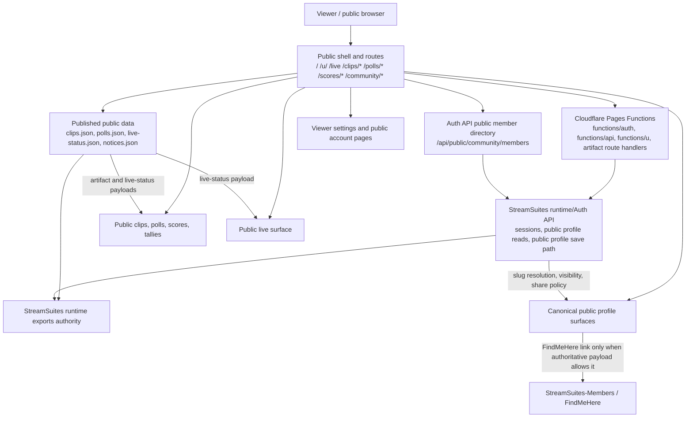

# StreamSuites-Public

Canonical public StreamSuites surface deployed to Cloudflare Pages at `https://streamsuites.app`.

## Release State

- Current Public milestone bucket: `0.5.4-alpha`; pending bucket: `0.5.5-alpha`. This redesign does not allocate or bump either value.
- Runtime-displayed version/build labels are consumed at runtime from `https://admin.streamsuites.app/runtime/exports/version.json`.
- `/version` is the human-readable diagnostic view of the canonical public `version-registry-public-v1` feed. It reads the feed through the existing same-origin `/api/public/*` Pages proxy and does not replace, cache, or become the authority for the source endpoint.
- `/status` is the canonical branded service-health view. It and the existing-page floating widget consume Atlassian Statuspage public read endpoints only; Runtime/Auth status synchronization and Statuspage mutation authority are unchanged.
- Runtime/Auth remains the canonical system-version authority. The checked-in Public mirror may lag the authoritative runtime export until the established publication workflow refreshes it.
- This repo is not a canonical state authority. It renders authoritative runtime exports and Auth API responses.

## Scope & Authority

- This repo is the public-facing site shell for profiles, public artifacts, viewer-facing pages, and public live discovery.
- Same-origin Cloudflare Pages Functions proxy browser requests to the authoritative Auth API, but they do not move backend ownership into this repo.
- Canonical slug resolution, profile visibility, share URLs, and FindMeHere eligibility remain runtime/Auth-owned in `StreamSuites`.
- Public routes render authoritative runtime exports and Auth payloads; they do not mint competing profile or live-status truth.

## Studio-First Public Identity

- The production `/` landing now presents StreamSuites as a connected livestream-production suite centered on Browser Studio and native StudioApp, with StreamSuites Studio for OBS as the separate OBS integration. Engagement, automation, alerts, overlays, profiles, progression, and public artifacts are connected capabilities around production.
- Browser Studio links to `https://studio.streamsuites.app`, remains closed-access and OFF AIR, and uses direct Cloudflare RealtimeKit browser media. Browser recording and broadcast output are not presented as shipped.
- StudioApp links to `/downloads/studioapp/`, remains a native Windows C#/.NET/WPF shell with a supervised C++20 media engine, and is explicitly not a WebView or browser wrapper.
- StreamSuites Studio for OBS links to `/downloads/obs-plugin/`, remains a plugin/integration rather than an OBS fork or replacement, and leaves scenes, mixing, composition, encoding, recording, and output inside OBS.
- Public Shell links to `https://streamsuites.app/clips` as the downstream public artifact surface. It does not capture, mix, encode, record, or output media.
- `/downloads/` is the searchable parent index for the current StudioApp, Studio for OBS, and Extensions surfaces. It presents only their published page-level status and routes; it does not create an artifact registry or download authority.
- Runtime/Auth remains the shared authority for identity, permissions, rooms, invitations, destinations, protected credentials, alerts, automation, exports, shared state, and canonical versioning. It is not the media path for Browser Studio, StudioApp, or OBS.
- `about.html` is now an editorial product-story page with the same product hierarchy and media-boundary explanation. Its existing manifest-driven consumer/developer records, stable anchors, expandable technical details, version/status hydration, and renderer hooks are retained; the three About JSON sources were refreshed to remove the obsolete three-repository/static-dashboard narrative.

## Shared Public Design System

- `css/public-fonts.css` is the local typography contract: Tektur for display headings, Geist Sans for body/UI copy, and IBM Plex Mono for version, status, system, code, and compact metadata. Every face uses `font-display: swap`; refreshed surfaces use `font-synthesis: none`; no external font request or JavaScript font loader is required.
- `css/studio-first-landing.css` owns the approved `pocv9` production adaptation and its corrective pass: the hero atmosphere is now deliberately weighted behind the left-side copy instead of the preview, `Run it your way.` has a slow product-aware blue/lime/violet/gold gradient, and the one DPR-capped canvas keeps most particles in the left/central field. The four equal-footprint Browser Studio/StudioApp/Studio for OBS/Public Shell states use subtle active-only float, border-glint, and transition motion. Browser and StudioApp share a reconstructed inner output rectangle that clips the complete scene, solo image, and overlays inside the stage rather than allowing media to bleed into the toolbar, rails, mixer, or outer frame. The Destinations signal uses a fixed icon column plus a protected non-wrapping `Runtime-owned` text track. Production `index.html` uses a bounded presentation revision on the stylesheet URL so a newly deployed document cannot reuse the earlier landing stylesheet. The landing header and footer retain the first-party square `assets/logos/ssmainlogosq.webp` plus `assets/logos/wmnew.webp` lockup; the Creator Login destinations, dismissible access notice, auth modal, OAuth/email/password, Turnstile, legal, account-switch, and temporary bypass controls remain unchanged.
- `css/standalone-pages.css` extends that accepted landing token, typography, header, navigation, footer, focus, and reduced-motion contract across About, Donate, Support, Privacy, Roadmap, Accessibility, and the Version Reference without changing the download cascades. The retained pages use the exact landing mark-plus-wordmark treatment, normal-flow footer, bounded desktop gutters, and collapsible mobile navigation; page-specific composition remains scoped to the standalone body classes.
- Standalone hero titles use a restrained bounded scale, and every standalone footer repeats the exact square-mark plus `wmnew.webp` wordmark lockup used by its header. The production landing footer now uses that exact lockup as well. Donate retains the six established suggested amounts, their impact explanations, five funding-use areas, trust guidance, and local-only donor-message preview while keeping Stripe Checkout as its only network action. Roadmap percentages count once as each programme enters view; progress bars and programme cards add restrained hover/focus sheen, with immediate static rendering under reduced motion.
- `version.html`, `css/version-page.css`, and `js/public-version.js` provide a compact, polished technical presentation of all components returned by the live public registry, including semantic-policy distinctions, state, event summaries, compatibility posture, filtering, per-component copy, a complete human-readable copy action, and a direct jump from the diagnostic hero to the component directory. Deployment-identity clients visibly inherit the live system version with a `System aligned` chip rather than implying an independent product semantic line. The Release Manager is identified separately as a local diagnostic companion because Runtime/Auth deliberately does not project a separate Release Manager product version in the public feed; no private admin registry data, executable-local version, or fabricated fallback snapshot is placed in Public.
- `status.html`, `css/status-page.css`, `js/status-data.js`, and `js/status-page.js` implement the approved comprehensive status center: overall posture, grouped health map, complete searchable/filterable component directory, active incidents, scheduled maintenance, recent public incident history, response latency, manual refresh, visible stale/unavailable states, mobile navigation, and reduced-motion behavior. Its post-hero sections use a consistent two-column heading rail, aligned metric baselines, explicit dark search/filter controls, and responsive one-, two-, and four-column compositions without relying on browser-native form presentation. `status.html` deliberately contains no widget host, widget stylesheet, widget controller, or automatic status slot.
- `css/status-widget.css` and `js/status-widget.js` replace the earlier reduced impacted-component tooltip with the approved floating rounded-square signal, hover/focus summary chip, plus/cross control derived from the existing UI assets, and complete all-component detail panel. The signal clips its own pulse and the idle toggle has no rectangular backdrop blur. The widget uses RAF-bounded footer geometry and a 12px design clearance so it rises above the lowest visible footer, then returns to its normal safe-area offset. The standalone `/u` profile preserves its pre-existing explicit inline slimline-footer mount while receiving the same upgraded data and panel. Stale refreshes retain only the last successful in-memory read; a first-read failure is shown as unavailable, never operational.
- Public page-visit analytics moved without contract changes from `js/status-widget.js` to `js/public-page-visit.js`. Existing pages still load it through the widget controller, while `/status` loads it directly so analytics remains independent of the explicit no-widget rule. The endpoint, payload, session marker, 30-second per-path dedupe, Beacon-first transport, fetch fallback, and secret-free behavior are preserved.
- `css/theme-dark.css`, `css/public-pages-v2.css`, and `css/public-shell.css` carry the cooler near-black graphite/steel/blue identity, selective cyan-indigo and purple depth, typography roles, focus language, layered cards, forms, tables, dialogs, loading/empty/error treatment, responsive spacing, and reduced-motion behavior across support, legal, auth, account, Public Dashboard, gallery, profile, and feature routes. The functional shell now uses a bounded 1540px content track, larger hero and section hierarchy, less fragmented dashboard grids, clearer selected navigation/filter states, and restrained entrance/hover motion.
- `js/studio-first-landing.js` owns keyboard-accessible four-state product tabs, ecosystem preview selection, the dismissible Alpha notice, mobile navigation, sticky-header progress, bounded hero particles, fine-pointer parallax/glow, visibility-aware authority-route sequencing, and progressive-enhancement reveals with reduced-motion fallbacks. It does not own auth, status, version, access enforcement, canonical state, or any product media path.
- `css/download-surface.css` now gives the Downloads index, StudioApp, OBS, and Extensions routes the same graphite/steel foundation, feature-accent title gradients, legible dark-on-accent actions, supplied platform-icon masks, restrained entrance/hover motion, and reduced-motion/forced-colors fallbacks. Product-specific styles keep accent color to trim and diagram details rather than applying a whole-page color wash. The active download subnavigation border follows each surface's feature color—blue for Downloads, green for StudioApp, violet for OBS, and blue for Extensions. StreamSuites Studio for OBS product headers and cards across the download pages use the dedicated `assets/icons/icon-obsextension.webp` mark. All three product mock-window titlebars use the same `icondiag-studioapp.svg` glyph while retaining their page-specific feature colors: lime for StudioApp, violet for OBS, and blue for Extensions. The generic OBS glyph continues to identify OBS-owned output and platform-action semantics. Their real manifest/catalog clients, fail-closed gates, HMAC/cookie boundary, controlled redirect, extension schema, and route handling remain intact.
- `css/feature-edges.css` is the shared, tokenized Status-style edge language. It preserves the Status geometry—28% header segment at right 12%, 34% footer segment at left 10%, and one CSS pixel at both edges—without loading on Status or duplicating its page-owned pseudo-elements. The landing maps the token to the one existing product state (blue Browser, lime StudioApp, violet OBS, gold Public); downloads inherit their existing product variables; Public shell/artifact pages use their established cool blue; standalone, legal, support, login-entry, and general pages use their established accent or canonical Public blue. OAuth callbacks, auth bridges, redirect shims, diagnostics, generated/machine surfaces, Functions, overlays, fixtures, archives, POCs, and build output are outside this rollout.
- The product-family section now contains the same four surfaces represented by the hero. `04 StreamSuites Public` uses the established gold accent and the existing `/clips` route, and describes only current Runtime/Auth-backed clips, polls, wheels, tallies, scoreboards, profiles, economy, leaderboards, and progression surfaces. It does not claim capture or media-engine ownership. The grid is four columns only at very wide desktop widths, two-by-two on ordinary desktop/tablet layouts, and one column on narrow screens.
- The supplied Profound, Halo, Backlog, Wope, and Evervault pages were used only as visual research for atmosphere placement, restrained glow, horizon depth, and edge treatment; no wording, asset, component, route, or interaction was copied into production.
- Responsive layouts are explicitly defined for desktop, tablet, short landscape, and narrow mobile widths. A stored expanded desktop sidebar preference is presented as the compact icon rail on narrow viewports without overwriting the user's desktop preference. Skip links, visible focus states, semantic tabs, keyboard arrow navigation, Escape handling, reduced-motion fallbacks, bounded content widths, readable long-form line lengths, and non-destructive card/route motion are part of the shared treatment. Under reduced motion, auroras, particles, gradient drift, preview float/glints, floating signals, and topology animation stop while the complete static atmosphere, output, topology, and 1px page edges remain visible. In normal motion, the canvas remains singular, capped at DPR 1.5 and bounded particle/link counts, and pauses while offscreen or document-hidden; inactive preview animation is paused.

## Repo-Scoped Flowchart


```mermaid
flowchart TD
    Viewer["Viewer / public browser"] --> Shell["Public shell and routes<br/>/ /u/<slug> /live /clips/* /polls/* /scores/* /community/*"]
    Shell --> Functions["Cloudflare Pages Functions<br/>functions/auth, functions/api, functions/u, artifact route handlers"]
    Shell --> Data["Published public data<br/>clips.json, polls.json, live-status.json, notices.json"]
    Shell --> AuthDirectory["Auth API public member directory<br/>/api/public/community/members"]

    Functions --> Auth["StreamSuites runtime/Auth API<br/>sessions, public profile reads, public profile save path"]
    Data --> Runtime["StreamSuites runtime exports authority"]
    AuthDirectory --> Auth
    Auth --> Runtime

    Shell --> Profiles["Canonical public profile surfaces"]
    Shell --> Artifacts["Public clips, polls, scores, tallies"]
    Shell --> Community["Viewer settings and public account pages"]
    Shell --> Live["Public live surface"]

    Auth -->|slug resolution, visibility, share policy| Profiles
    Data -->|artifact and live-status payloads| Artifacts
    Data -->|live-status payload| Live
    Profiles -->|FindMeHere link only when authoritative payload allows it| Members["StreamSuites-Members / FindMeHere"]
```

## Current Surface Model

- `/` is the Studio Command Center landing with real product routes, four equal-footprint illustrative preview states, product-specific media ownership, a five-node Runtime/Auth authority topology, connected Public capabilities, restrained motion, wider ecosystem links, and hydrated status/version metadata. Its original `/auth/access-state`, `/auth/session`, OAuth/email auth, Turnstile, access-code, lockout-banner, and creator-routing contracts remain in place. The landing and shared Public-shell login modals use the first-party square `assets/logos/ssmainlogosq.webp` brand mark.
- `/about.html` is the full product story plus the existing manifest-driven technical record.
- `/donate.html` preserves the existing one-time StreamSuites billing endpoint and Stripe Checkout handoff while presenting truthful integer amount validation, busy/error states, and payment/account boundaries. `/donate-success.html` and `/donate-cancel.html` remain the configured return surfaces.
- `/support.html` presents verified documentation, account, troubleshooting, donation, incident, and Discord pathways as distinct feature-icon cards with scoped accent treatments and accessible reduced-motion behavior. Its custom read-only Discord community card consumes Discord's enabled public guild-widget JSON directly, safely renders published presence and visible voice channels, preserves the verified support-channel deep link, and keeps a server-rendered Join action available even when live presence cannot load. Its future first-party ticket-centre form/history structure is explicitly disabled and performs no submission, upload, persistence, account lookup, or ticket-state work.
- `/privacy.html` preserves the February 22, 2026 policy text and date in a long-form reading layout with a responsive section index and stable anchors. `/accessibility.html` describes current practices and limitations without claiming audit, certification, or formal conformance.
- `/roadmap` is the canonical public programme roadmap. Eight conservative integer estimates replace the former implementation-entry inventory, while detailed release changelogs link to verified StreamSuites Docs routes.
- `/version` is the canonical human-facing master version reference. It renders all 13 components currently returned by the authoritative public registry, keeps null/deferred/uninitialized states explicit, and falls back to a truthful unavailable state rather than stale or hardcoded version data. Copy actions produce readable diagnostic text rather than exposing raw JSON.
- `/status` is the primary StreamSuites human-facing service-health route. It preserves Atlassian as the public data source, hosted archive, and subscription destination while providing the complete branded component, incident, maintenance, history, freshness, and transparency presentation. The route follows the same extensionless Pages convention as `/version`; `status-check.html` remains a separate widget diagnostic surface.
- `/downloads/` is the searchable parent download index. Its three checked-in records route to StudioApp, Studio for OBS, and Extensions and mirror only truthful static page status; Browser Studio is explicitly presented as a no-install external surface.
- `/downloads/studioapp` is the canonical Windows StudioApp ALPHA landing page. Its same-origin `/api/downloads/studioapp/release` metadata seam remains visible while download access is locked, validates strict schema-v2 `product-manifest.json` with bounded schema-v1 fallback, treats independent StudioApp product version/build as primary and optional StreamSuites system compatibility as secondary, and never uses Runtime `version.json` as installer identity. Only an authorized short-lived session enables the separate controlled redirect; the static page and metadata response contain no raw installer URL.
- The StudioApp page shows macOS and Linux as disabled Coming Soon release/requirements scaffolds with no version, build, date, package size, compatibility, or artifact claim. The Windows storage guidance references the manifest-hydrated installer size plus installation/update headroom and separate media storage instead of inventing an unsupported fixed minimum.
- Download lockout is configured only through Pages environment values (`DOWNLOAD_ACCESS_LOCKED`, `DOWNLOAD_ACCESS_MESSAGE`, `DOWNLOAD_BYPASS_ENABLED`, secret `DOWNLOAD_BYPASS_CODE`, bounded `DOWNLOAD_BYPASS_TTL_MINUTES`, and `SHOW_DOWNLOAD_LOCKOUT_BANNER`). Approved tester access uses a short-lived HMAC-signed HttpOnly/Secure/SameSite cookie scoped to the download API. Failure to validate access, cookie, or manifest keeps the download unavailable.
- `/downloads/obs-plugin/` truthfully presents **StreamSuites Studio for OBS** as in development. It publishes no artifact, version, release date, or compatibility claim; Runtime/Auth remains the control authority and OBS owns the media pipeline.
- `/downloads/studioapp/extensions/` is a searchable directory shell backed by the versioned, intentionally empty `data/studioapp-extension-catalog.v1.json` presentation contract. Public is not an extension registry: future listings must come from Runtime/Auth or an authoritative generated export, and the current catalog contains no installable item or executable-download field.
- The public `/home` and `/community` experiences now share one dashboard-style shell and one sidebar/navigation model, with the main Dashboard group listed before Production, `/home` remaining the default public home tab for the public dashboard, and `/media` preserved only as a compatibility entry. The shell brand uses the first-party square `assets/logos/ssmainlogosq.webp` icon; its title and subheading chip use Tektur at bold and regular weights respectively, while authenticated account-overview values use a system-monospace stack.
- Canonical public profiles resolve at `/u/<slug>`, backed by the authoritative public slug model exported by `StreamSuites`.
- Legacy `user_code` compatibility is still preserved during profile resolution and migration-safe routing.
- Clean public artifact routes are supported for clips, polls, and scores via `/clips/<id-or-slug>`, `/polls/<id-or-slug>`, and `/scores/<id-or-slug>`, while legacy detail entry points remain available.
- `/community/settings.html` is the viewer/public account profile settings surface and loads or saves supported authoritative fields through the public profile API.
- `/community/my-data.html` now reads the signed-in user’s real public XP/level progression from `/api/public/progression/me`, wallet/inventory state from `/api/public/economy/me`, and public-authority request history from the authoritative `/api/public/authority/requests/mine` contract.
- `/wheels` is now the primary public consumer route for authoritative wheel artifacts published by `StreamSuites`, `/scoreboards` is preserved as the legacy list-view lens over that same wheel artifact data, and `/leaderboards` reads the first public progression leaderboard from the authoritative XP/level API while using rank only for placement.
- Public wheel gallery/detail hydration is now API-first against `/api/public/wheels`, with the shared-state/runtime-export copies retained only as fallback mirrors and a narrow runtime SSE stream keeping already-open wheel pages in sync.
- Standalone and in-shell public profile surfaces now consume the runtime-published public authority identity summaries so profile claim, assignment, issue, and removal requests submit against real `identity_code` targets instead of placeholder payloads.
- Public profiles render dual share behavior truthfully: StreamSuites links always use the canonical slug URL, and FindMeHere links render only when the authoritative payload marks the account eligible and visible there.
- Live badge, live ring, live-directory cards, and live profile-banner treatment consume the centralized runtime `live_status` export first. Individual `/u/*` profiles render the normalized latest/current livestream in the PlayViewer area when Runtime provides safe embed/source fields, and render the slim recent stream tray from real recent rows, Runtime `tray_sources`, or the current/latest source record. Ended Kick evidence stays a recent poster/source-card fallback without a live-only `player.kick.com` iframe. Optional Rumble discovery enrichment is used only when the existing UI needs missing watch/title metadata.
- `/live` is the dedicated public live view and only lists creators whose StreamSuites public profile is currently eligible and visible.
- Reserved media fields are reflected from the authoritative payload, including cover or banner usage plus reserved `background_image_url`.

### Route treatment for this milestone

- Fully redesigned expressive surfaces: `/`, `/about.html`, `/donate.html`, `/support.html`, `/privacy.html`, `/roadmap`, `/version`, `/accessibility.html`, and the presentation-only `404.html`. Download implementations remain visually protected reference surfaces.
- Visually harmonized functional surfaces: `/home`, clips, polls, wheels, tallies, scoreboards, leaderboards, games/economy, market exchange, `/live`, community pages, settings/my-data, and `/u` profiles through the shared `public-shell.css` and existing renderer code.
- Visually harmonized quiet utility/information surfaces: login/auth pages, requests entry pages, resources, stats, terms, and postmortem through the existing shared page styles. The obsolete rendered Tools page is removed; the former Changelog page is replaced by Roadmap.
- Purpose-built download surfaces: `/downloads/`, `/downloads/studioapp/`, `/downloads/obs-plugin/`, and `/downloads/studioapp/extensions/`; their polished diagrams, search/catalog treatments, platform states, and feature trim share one download-specific system while preserving each route's real behavior.
- Intentionally excluded from production mutation: auth callback/bridge shims, overlay/browser-source surfaces, generated exports, functions/data artifacts, fixtures/samples, archived `index-v2.html` plus `css/aurora-landing-v2.css`, the `sspoc1` reference, the approved read-only `pocv9` reference, and preserved ZIP archives.

### Landing and feature-edge corrective validation

Human-facing coverage is inventoried in `tests/public-feature-edges.test.mjs`: landing/marketing; the generated Public application shell and artifact, community, live, profile, economy, and statistics entries; downloads; standalone information/support/legal pages; login entry pages; and 404. Status retains its existing page-owned edge pair. The explicit exclusions above also cover OAuth completion pages, auth bridges, compatibility/redirect shims, `status-check.html`, and retained POCs.

The focused checks are:

```powershell
node --check js/studio-first-landing.js
node --test tests/studio-first-public-experience.test.mjs tests/public-feature-edges.test.mjs
node --test tests
git diff --check
```

Browser validation is served over local HTTP and covers `390×844`, `430×932`, `768×1024`, `1024×768`, `1366×768`, `1600×1000`, `1920×1080`, `844×390`, `1600×640`, and a `1093×614` CSS viewport at device scale factor 1.25. It checks every product state, the four-card breakpoints, exact inner-output clipping, Destinations containment, header/footer colors and geometry on representative routes, 16 seconds of normal motion, reduced motion, visibility/offscreen canvas suspension, and document-level overflow. Local static-server `/auth/*` failures and analytics CORS messages are expected environment noise and are not production-service evidence. No files were removed. The only production/test files created by this corrective are `css/feature-edges.css` and `tests/public-feature-edges.test.mjs`.

## Routing and Runtime Integration

- Cloudflare Pages routing is handled by the root `_redirects` file plus Pages Functions under `functions/`.
- Cloudflare Pages clean-URL handling serves the single `roadmap.html` surface at canonical `/roadmap`; `/roadmap/` normalizes to it. The retired `/changelog`, `/changelog/`, and `/changelog.html` routes redirect permanently to the canonical Docs changelog index at `https://docs.streamsuites.app/docs/changelog`; no second Changelog page is rendered.
- Cloudflare Pages clean-URL handling serves `version.html` at canonical `/version`. Its browser client reads `/api/public/version-registry` through the existing allowlisted `/api/public/*` Pages proxy, which forwards to Runtime/Auth without changing ownership or exposing the private administrative registry export.
- The obsolete `/tools`, `/tools/`, and `/tools.html` routes redirect permanently to `/downloads/`. The singular `/download`, `/download/`, and `/download.html` compatibility routes use the same destination.
- `/downloads` and its trailing-slash alias resolve to the searchable static parent index.
- `/downloads/studioapp` and its trailing-slash alias resolve to the same static landing page; `/api/downloads/studioapp/*` owns access-state, unlock/end-session, locked-safe release metadata, and controlled-download behavior. `access-state` reports explicit configured/missing-variable state without exposing values, and arbitrary redirect parameters or stale version/build requests fail closed. The dismissible banner is presentation-only and never authorizes a download.
- `/downloads/obs-plugin` and `/downloads/studioapp/extensions` resolve to their directory pages; normal directory routing serves the trailing-slash forms used by product navigation.
- The legacy public `/requests` route is now expected to hand off to the developer console feedback hub at `https://console.streamsuites.app/feedback`, while authoritative request data remains runtime-owned.
- Same-origin auth and API proxy paths forward browser requests to the authoritative Auth API without moving backend ownership into this repo.
- Public auth entry points now consume `/auth/access-state` and the short-lived `/auth/debug/unlock` bypass flow so public pages remain browseable while new auth starts can be gated by runtime mode.
- Route handlers under `functions/clips`, `functions/leaderboards`, `functions/polls`, `functions/scoreboards`, `functions/scores`, `functions/tallies`, `functions/wheels`, and `functions/u` preserve gallery deep links plus clean artifact and profile routes.
- Public shell/profile code in `js/public-pages-app.js` and `js/public-data-hub.js` consumes the authoritative slug, visibility, FindMeHere eligibility, media, live-status fields, economy/inventory summaries, and the runtime-owned community member directory API.

## StudioApp Download Gate Operations

The gate owns the canonical page and its normal same-origin download action. The installer exists only in R2; the alpha manifest identifies the latest immutable object and the Public repository never receives a second installer upload. `deployment-markers/studioapp-release.json` is a deterministic nonsecret schema-2 correlation identity derived from canonical relevant Public source (excluding the marker), product, published version/build, and route. It contains no clock, random value, branch, or self-referential commit SHA; remote Git SHA is verified separately. The private StudioApp Release Manager semantically verifies the page, access/release APIs, rendered metadata, exact marker, manifest and locked redirect. Its optional authorized check reads the tester code from Windows Credential Manager target `BrainstreamMediaGroup.StreamSuites.ReleaseManager.PublicDownloadBypass`, keeps it only in clearable memory while submitting the unlock request, verifies the short-lived cookie and exact redirect without downloading installer bytes, relocks the session, and never writes the code to settings, evidence, arguments, or logs. It does not invoke a Pages deployment API.

Configure Production and Preview independently in Cloudflare:

1. Open **Cloudflare Dashboard**.
2. Open **Workers & Pages** and select the StreamSuites-Public Pages project.
3. Open **Settings**, then **Bindings**. Add an R2 bucket binding named exactly `STREAMSUITES_UPDATES_BUCKET` and select the existing `streamsuites-updates` bucket.
4. Apply that binding independently to both Production and Preview.
5. Open **Settings**, then **Variables and Secrets**.
6. Add `DOWNLOAD_ACCESS_LOCKED`, `DOWNLOAD_ACCESS_MESSAGE`, `DOWNLOAD_BYPASS_ENABLED`, `DOWNLOAD_BYPASS_TTL_MINUTES`, and `SHOW_DOWNLOAD_LOCKOUT_BANNER` as normal variables.
7. Add `DOWNLOAD_BYPASS_CODE` only as an encrypted Secret. Never put its value in Git, `.env.example`, Pages client JavaScript, or browser storage.
8. Apply appropriate values separately to Production and Preview.
9. Redeploy the Pages project after changing bindings or values.

`DOWNLOAD_BYPASS_TTL_MINUTES` safely defaults to 15 minutes when absent or invalid, while `access-state` still reports that Production/Preview configuration as requiring correction. Missing lock configuration defaults to locked. The temporary authorization cookie is HMAC-signed from the configured bypass secret, contains no bypass code, and is HttpOnly, Secure, SameSite=Lax, expiring, and scoped to `/api/downloads/studioapp`.

This repository is a static Pages project with no package manifest, install step, lint script, typecheck, or bundle build. `wrangler.toml` is the checked-in Pages runtime contract. Pages Functions read `studioapp/windows-x64/alpha/product-manifest.json` directly from `env.STREAMSUITES_UPDATES_BUCKET`; only a genuinely missing product object or an unsupported integer product schema may fall back to `studioapp/windows-x64/alpha/manifest.json`. Missing bindings, R2 read failures, oversized or invalid UTF-8 bodies, JSON parse failures, and strict identity/security contract failures remain distinct nonsecret diagnostics and fail closed. Valid metadata remains visible while access is locked; only the controlled installer route is denied.

Production never silently switches to public HTTP manifest fetching. The `STUDIOAPP_MANIFEST_HTTP_FALLBACK_ENABLED` compatibility seam is accepted only on localhost, `127.0.0.1`, or a Cloudflare Preview `.pages.dev` host. Local browser verification may instead use the localhost-only `LOCAL_STUDIOAPP_RELEASE_FIXTURE` and bounded `STUDIOAPP_RELEASE_FIXTURE_JSON` bindings in a temporary untracked environment file; production hosts reject both development seams, and test files/processes/state must be removed afterward. Run the focused download-surface contracts with `node --test tests/studioapp-download-gate.test.mjs tests/download-surfaces.test.mjs tests/studioapp-extensions.test.mjs`. Route and Pages Function behavior must also be validated in a Cloudflare Preview before production deployment. Normal StudioApp R2 publication requires no Public redeployment. Redeploy Public only when page/function source, bindings, or Pages variables change, through the separate manual commit/push/Cloudflare workflow.

## Public Typography Assets and Studio Download Contracts

The approved local font files were already present under the production asset tree, so this milestone copied no font binary:

- Display: `assets/fonts/Tektur-VariableFont_wdth,wght.ttf` (`400–900`, `75%–100%` stretch).
- Body/UI: `assets/fonts/Geist-Light.ttf`, `Geist-Regular.ttf`, `Geist-Medium.ttf`, `Geist-SemiBold.ttf`, `Geist-Bold.ttf`, and `Geist-ExtraBold.ttf`.
- System metadata: `assets/fonts/mono/IBMPlexMono-Light.ttf`, `IBMPlexMono-Regular.ttf`, `IBMPlexMono-Medium.ttf`, `IBMPlexMono-SemiBold.ttf`, and `IBMPlexMono-Bold.ttf`.
- The existing Geist and IBM Plex Mono license files remain at `assets/fonts/GEISTMONOOFL.txt` and `assets/fonts/mono/IBMPLEXMONOOFL.txt`.
- The POC/font-package notes reference a Tektur `OFL.txt`, but that exact license file was not found in the POC or neighboring StreamSuites repositories. No license text was fabricated. Recovering and reviewing that file remains a release/licensing follow-up before publication.
- Studio brand mark: `assets/logos/studiologo3.webp`, byte-identical to the Browser Studio asset selected by `src/components/BrandMark.tsx` (SHA-256 `43C28A45FBABC4A710C4DAD151ECD33952FA823C5A2E17D615343F1C6BF7A786`).

`css/download-surface.css` owns the shared restrained dark shell, product navigation, gradient title treatment, platform-button icon masks, responsive spacing, focus treatment, reduced-motion handling, and forced-colors support. `css/download-index.css` and `js/download-index.js` own the parent index diagram and bounded client-side search/URL state; the three records remain static links rather than canonical product data. Product-specific CSS keeps status, capability, and illustration presentation separate. The extension JavaScript accepts only a bounded schema-v1 allowlist, rejects unknown fields and unsafe URLs, creates content with DOM text nodes, and keeps search/filter state in the URL. Synthetic catalog entries belong only in tests; production remains empty until canonical authority exists.

The design reference is preserved at `sspoc1/`. Its original archive remains `StreamSuites-Landing-POC-Option-1-Typography.zip`; `StreamSuites-Landing-POC-Option-1.zip` is also retained. Production uses the existing `assets/fonts/` copies rather than loading the POC directory.

## Cross-Repo Orientation

- Top-level authority map: [StreamSuites runtime README](https://github.com/BSMediaGroup/StreamSuites)
- Admin-surface detail: [StreamSuites-Dashboard README](https://github.com/BSMediaGroup/StreamSuites-Dashboard)
- Creator-surface detail: [StreamSuites-Creator README](https://github.com/BSMediaGroup/StreamSuites-Creator)
- FindMeHere detail: [StreamSuites-Members README](https://github.com/BSMediaGroup/StreamSuites-Members)

## Repository Tree (Abridged, Current)

```text
StreamSuites-Public/
├── .env.example             # Download-gate variable names; secret value intentionally blank
├── .gitignore
├── _redirects
├── 404.html
├── about.html
├── accessibility.html
├── auth-bridge.html
├── donate.html
├── donate-cancel.html
├── donate-success.html
├── economy.html
├── home.html
├── index.html
├── index-v2.html
├── StreamSuites-Landing-POC-Option-1-Typography.zip
├── StreamSuites-Landing-POC-Option-1.zip
├── market-exchange/
│   └── index.html
├── market-exchange.html
├── media.html                  # Compatibility shim for old /media.html links
├── public-login.html
├── privacy.html
├── README.md
├── roadmap.html
├── wrangler.toml              # Pages runtime compatibility contract
├── requests-login.html
├── requests.html
├── leaderboards.html
├── stats.html
├── support.html
├── status.html
├── version.html
├── wheels.html
├── BUMP_NOTES.md
├── changelog/
│   └── v0.5.0-CHANGELOG.md
├── functions/
│   ├── [[path]].js
│   ├── _shared/
│   │   ├── artifact-route.js
│   │   ├── auth-api-proxy.js
│   │   └── studioapp-download-gate.js
│   ├── api/
│   │   ├── [[path]].js
│   │   └── downloads/studioapp/
│   │       ├── access-state.js
│   │       ├── latest.js
│   │       ├── lock.js
│   │       ├── release.js
│   │       └── unlock.js
│   ├── auth/
│   │   └── [[path]].js
│   ├── clips/
│   │   ├── [[artifact]].js
│   │   └── index.js
│   ├── leaderboards/
│   │   └── index.js
│   ├── oauth/
│   │   └── [[path]].js
│   ├── polls/
│   │   ├── [[artifact]].js
│   │   └── index.js
│   ├── scoreboards/
│   │   └── index.js
│   ├── scores/
│   │   ├── [[artifact]].js
│   │   └── index.js
│   ├── tallies/
│   │   └── index.js
│   ├── wheels/
│   │   ├── [[artifact]].js
│   │   └── index.js
│   └── u/
│       └── [[slug]].js
├── deployment-markers/
│   └── studioapp-release.json # Nonsecret production deployment correlation
├── community/
│   ├── index.html
│   ├── members.html
│   ├── my-data.html
│   ├── notices.html
│   ├── profile.html
│   └── settings.html
├── live/
│   └── index.html
├── downloads/
│   ├── index.html
│   ├── obs-plugin/
│   │   └── index.html
│   └── studioapp/
│       ├── extensions/
│       │   └── index.html
│       └── index.html
├── login/
│   └── index.html
├── u/
│   └── index.html
├── clips/
│   ├── detail.html
│   └── [sample media files]
├── polls/
│   ├── detail.html
│   └── results.html
├── scoreboards/
│   └── detail.html
├── tallies/
│   └── detail.html
├── wheels/
│   └── detail.html
├── data/
│   ├── changelog.json
│   ├── changelog.runtime.json
│   ├── clips.json
│   ├── live-status.json
│   ├── meta.json
│   ├── notices.json
│   ├── polls.json
│   ├── roadmap.json
│   ├── scoreboards.json
│   ├── studioapp-extension-catalog.v1.json
│   ├── tallies.json
│   └── wheels.json
├── js/
│   ├── download-index.js
│   ├── public-badge-ui.js
│   ├── public-data-hub.js
│   ├── public-pages-app.js
│   ├── public-page-visit.js
│   ├── public-donate.js
│   ├── public-roadmap.js
│   ├── public-version.js
│   ├── public-requests.js
│   ├── public-shell.js
│   ├── studio-first-landing.js
│   ├── status-data.js
│   ├── status-page.js
│   ├── public-toast.js
│   ├── studioapp-extensions.js
│   ├── studioapp-download.js
│   ├── status-widget.js
│   ├── support-discord-widget.js
│   ├── turnstile-inline.js
│   └── utils/
│       ├── about-data.js
│       ├── version-stamp.js
│       └── versioning.js
├── css/
│   ├── aurora-landing-v2.css
│   ├── download-index.css
│   ├── download-surface.css
│   ├── feature-edges.css
│   ├── public-fonts.css
│   ├── obs-plugin-download.css
│   ├── public-login.css
│   ├── public-pages-v2.css
│   ├── public-shell.css
│   ├── requests-auth.css
│   ├── requests.css
│   ├── studioapp-extensions.css
│   ├── studioapp-download.css
│   ├── studio-first-landing.css
│   ├── standalone-pages.css
│   ├── status-page.css
│   ├── version-page.css
│   └── status-widget.css
├── tests/
│   ├── auth-surface-parity.test.mjs
│   ├── download-surfaces.test.mjs
│   ├── live-status-authority.test.mjs
│   ├── public-authority-wiring.test.mjs
│   ├── public-feature-edges.test.mjs
│   ├── studioapp-download-gate.test.mjs
│   ├── studioapp-extensions.test.mjs
│   ├── studio-first-public-experience.test.mjs
│   ├── standalone-public-pages.test.mjs
│   ├── status-center.test.mjs
│   ├── version-page.test.mjs
│   └── wheels-authority.test.mjs
├── pocv9/                     # Approved read-only landing motion and diagram reference
│   ├── index.html
│   ├── styles.css
│   ├── app.js
│   ├── README.md
│   ├── MOTION_SPEC.md
│   └── SHA256SUMS.txt
├── sspoc1/                    # Read-only visual/typography reference retained in place
│   ├── index.html
│   ├── app.js
│   ├── styles.css
│   ├── assets/
│   └── previews/
└── assets/
    ├── css/
    │   └── ss-profile-hovercard.css
    ├── fonts/
    │   ├── Tektur-VariableFont_wdth,wght.ttf
    │   ├── Geist-{Light,Regular,Medium,SemiBold,Bold,ExtraBold}.ttf
    │   ├── GEISTMONOOFL.txt
    │   └── mono/
    │       ├── IBMPlexMono-{Light,Regular,Medium,SemiBold,Bold}.ttf
    │       └── IBMPLEXMONOOFL.txt
    ├── placeholders/
    │   └── wheelcenterdefault.webp
    └── icons/
        ├── alpha.svg
        ├── beta.svg
        ├── icon-releasemanager.png
        ├── icondiag-studioapp.svg
        ├── icondiag-studioweb.svg
        ├── obs-0.svg
        ├── streamsuites-0.svg
        ├── wheelarrow.svg
        └── ui/
            ├── clipboard.svg
            ├── cmdkey.svg
            ├── filters.svg
            ├── findmehereicon.svg
            ├── search.svg
            ├── ss-admin.svg
            ├── ss-creator.svg
            ├── ss-developer.svg
            ├── ss-public.svg
            ├── sidebar.svg
            ├── sidebarclose.svg
            ├── sidebaropen.svg
            └── streamsuitesicon.svg
```
