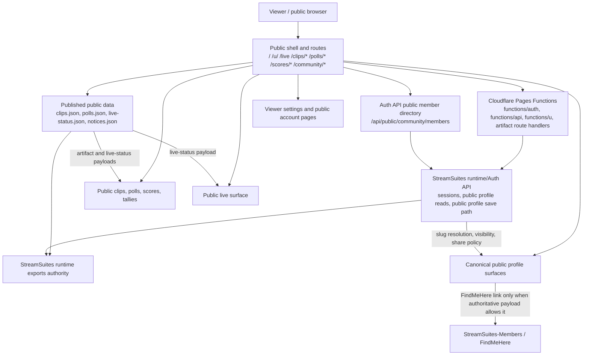

# StreamSuites-Public

Canonical public StreamSuites surface deployed to Cloudflare Pages at `https://streamsuites.app`.

## Release State

- README state prepared for `v0.5.0-alpha`.
- Runtime-displayed version/build labels are consumed at runtime from `https://admin.streamsuites.app/runtime/exports/version.json`.
- This repo is not a canonical state authority. It renders authoritative runtime exports and Auth API responses.

## Scope & Authority

- This repo is the public-facing site shell for profiles, public artifacts, viewer-facing pages, and public live discovery.
- Same-origin Cloudflare Pages Functions proxy browser requests to the authoritative Auth API, but they do not move backend ownership into this repo.
- Canonical slug resolution, profile visibility, share URLs, and FindMeHere eligibility remain runtime/Auth-owned in `StreamSuites`.
- Public routes render authoritative runtime exports and Auth payloads; they do not mint competing profile or live-status truth.

## Repo-Scoped Flowchart


```mermaid
flowchart TD
    Viewer["Viewer / public browser"] --> Shell["Public shell and routes<br/>/ /u/<slug> /live /clips/* /polls/* /scores/* /community/*"]
    Shell --> Functions["Cloudflare Pages Functions<br/>functions/auth, functions/api, functions/u, artifact route handlers"]
    Shell --> Data["Published public data<br/>clips.json, polls.json, live-status.json, notices.json"]
    Shell --> AuthDirectory["Auth API public member directory<br/>/api/public/community/members"]

    Functions --> Auth["StreamSuites runtime/Auth API<br/>sessions, public profile reads, public profile save path"]
    Data --> Runtime["StreamSuites runtime exports authority"]
    AuthDirectory --> Auth
    Auth --> Runtime

    Shell --> Profiles["Canonical public profile surfaces"]
    Shell --> Artifacts["Public clips, polls, scores, tallies"]
    Shell --> Community["Viewer settings and public account pages"]
    Shell --> Live["Public live surface"]

    Auth -->|slug resolution, visibility, share policy| Profiles
    Data -->|artifact and live-status payloads| Artifacts
    Data -->|live-status payload| Live
    Profiles -->|FindMeHere link only when authoritative payload allows it| Members["StreamSuites-Members / FindMeHere"]
```

## Current Surface Model

- `/downloads/studioapp` is the canonical Windows StudioApp ALPHA landing page. Its same-origin `/api/downloads/studioapp/release` metadata seam remains visible while download access is locked, validates strict schema-v2 `product-manifest.json` with bounded schema-v1 fallback, treats independent StudioApp product version/build as primary and optional StreamSuites system compatibility as secondary, and never uses Runtime `version.json` as installer identity. Only an authorized short-lived session enables the separate controlled redirect; the static page and metadata response contain no raw installer URL.
- Download lockout is configured only through Pages environment values (`DOWNLOAD_ACCESS_LOCKED`, `DOWNLOAD_ACCESS_MESSAGE`, `DOWNLOAD_BYPASS_ENABLED`, secret `DOWNLOAD_BYPASS_CODE`, bounded `DOWNLOAD_BYPASS_TTL_MINUTES`, and `SHOW_DOWNLOAD_LOCKOUT_BANNER`). Approved tester access uses a short-lived HMAC-signed HttpOnly/Secure/SameSite cookie scoped to the download API. Failure to validate access, cookie, or manifest keeps the download unavailable.
- `/downloads/obs-plugin/` truthfully presents **StreamSuites Studio for OBS** as in development. It publishes no artifact, version, release date, or compatibility claim; Runtime/Auth remains the control authority and OBS owns the media pipeline.
- `/downloads/studioapp/extensions/` is a searchable directory shell backed by the versioned, intentionally empty `data/studioapp-extension-catalog.v1.json` presentation contract. Public is not an extension registry: future listings must come from Runtime/Auth or an authoritative generated export, and the current catalog contains no installable item or executable-download field.
- The public `/home` and `/community` experiences now share one dashboard-style shell and one sidebar/navigation model, with `/home` remaining the default public home tab for the public dashboard and `/media` preserved only as a compatibility entry.
- Canonical public profiles resolve at `/u/<slug>`, backed by the authoritative public slug model exported by `StreamSuites`.
- Legacy `user_code` compatibility is still preserved during profile resolution and migration-safe routing.
- Clean public artifact routes are supported for clips, polls, and scores via `/clips/<id-or-slug>`, `/polls/<id-or-slug>`, and `/scores/<id-or-slug>`, while legacy detail entry points remain available.
- `/community/settings.html` is the viewer/public account profile settings surface and loads or saves supported authoritative fields through the public profile API.
- `/community/my-data.html` now reads the signed-in user’s real public XP/level progression from `/api/public/progression/me`, wallet/inventory state from `/api/public/economy/me`, and public-authority request history from the authoritative `/api/public/authority/requests/mine` contract.
- `/wheels` is now the primary public consumer route for authoritative wheel artifacts published by `StreamSuites`, `/scoreboards` is preserved as the legacy list-view lens over that same wheel artifact data, and `/leaderboards` reads the first public progression leaderboard from the authoritative XP/level API while using rank only for placement.
- Public wheel gallery/detail hydration is now API-first against `/api/public/wheels`, with the shared-state/runtime-export copies retained only as fallback mirrors and a narrow runtime SSE stream keeping already-open wheel pages in sync.
- Standalone and in-shell public profile surfaces now consume the runtime-published public authority identity summaries so profile claim, assignment, issue, and removal requests submit against real `identity_code` targets instead of placeholder payloads.
- Public profiles render dual share behavior truthfully: StreamSuites links always use the canonical slug URL, and FindMeHere links render only when the authoritative payload marks the account eligible and visible there.
- Live badge, live ring, live-directory cards, and live profile-banner treatment consume the centralized runtime `live_status` export first. Individual `/u/*` profiles render the normalized latest/current livestream in the PlayViewer area when Runtime provides safe embed/source fields, and render the slim recent stream tray from real recent rows, Runtime `tray_sources`, or the current/latest source record. Ended Kick evidence stays a recent poster/source-card fallback without a live-only `player.kick.com` iframe. Optional Rumble discovery enrichment is used only when the existing UI needs missing watch/title metadata.
- `/live` is the dedicated public live view and only lists creators whose StreamSuites public profile is currently eligible and visible.
- Reserved media fields are reflected from the authoritative payload, including cover or banner usage plus reserved `background_image_url`.

## Routing and Runtime Integration

- Cloudflare Pages routing is handled by the root `_redirects` file plus Pages Functions under `functions/`.
- `/downloads/studioapp` and its trailing-slash alias resolve to the same static landing page; `/api/downloads/studioapp/*` owns access-state, unlock/end-session, locked-safe release metadata, and controlled-download behavior. `access-state` reports explicit configured/missing-variable state without exposing values, and arbitrary redirect parameters or stale version/build requests fail closed. The dismissible banner is presentation-only and never authorizes a download.
- `/downloads/obs-plugin` and `/downloads/studioapp/extensions` resolve to their directory pages; normal directory routing serves the trailing-slash forms used by product navigation.
- The legacy public `/requests` route is now expected to hand off to the developer console feedback hub at `https://console.streamsuites.app/feedback`, while authoritative request data remains runtime-owned.
- Same-origin auth and API proxy paths forward browser requests to the authoritative Auth API without moving backend ownership into this repo.
- Public auth entry points now consume `/auth/access-state` and the short-lived `/auth/debug/unlock` bypass flow so public pages remain browseable while new auth starts can be gated by runtime mode.
- Route handlers under `functions/clips`, `functions/leaderboards`, `functions/polls`, `functions/scoreboards`, `functions/scores`, `functions/tallies`, `functions/wheels`, and `functions/u` preserve gallery deep links plus clean artifact and profile routes.
- Public shell/profile code in `js/public-pages-app.js` and `js/public-data-hub.js` consumes the authoritative slug, visibility, FindMeHere eligibility, media, live-status fields, economy/inventory summaries, and the runtime-owned community member directory API.

## StudioApp Download Gate Operations

The gate owns the canonical page and its normal same-origin download action. The installer exists only in R2; the alpha manifest identifies the latest immutable object and the Public repository never receives a second installer upload. `deployment-markers/studioapp-release.json` is a deterministic nonsecret schema-2 correlation identity derived from canonical relevant Public source (excluding the marker), product, published version/build, and route. It contains no clock, random value, branch, or self-referential commit SHA; remote Git SHA is verified separately. The private StudioApp Release Manager semantically verifies the page, access/release APIs, rendered metadata, exact marker, manifest and locked redirect. Its optional authorized check reads the tester code from Windows Credential Manager target `BrainstreamMediaGroup.StreamSuites.ReleaseManager.PublicDownloadBypass`, keeps it only in clearable memory while submitting the unlock request, verifies the short-lived cookie and exact redirect without downloading installer bytes, relocks the session, and never writes the code to settings, evidence, arguments, or logs. It does not invoke a Pages deployment API.

Configure Production and Preview independently in Cloudflare:

1. Open **Cloudflare Dashboard**.
2. Open **Workers & Pages** and select the StreamSuites-Public Pages project.
3. Open **Settings**, then **Bindings**. Add an R2 bucket binding named exactly `STREAMSUITES_UPDATES_BUCKET` and select the existing `streamsuites-updates` bucket.
4. Apply that binding independently to both Production and Preview.
5. Open **Settings**, then **Variables and Secrets**.
6. Add `DOWNLOAD_ACCESS_LOCKED`, `DOWNLOAD_ACCESS_MESSAGE`, `DOWNLOAD_BYPASS_ENABLED`, `DOWNLOAD_BYPASS_TTL_MINUTES`, and `SHOW_DOWNLOAD_LOCKOUT_BANNER` as normal variables.
7. Add `DOWNLOAD_BYPASS_CODE` only as an encrypted Secret. Never put its value in Git, `.env.example`, Pages client JavaScript, or browser storage.
8. Apply appropriate values separately to Production and Preview.
9. Redeploy the Pages project after changing bindings or values.

`DOWNLOAD_BYPASS_TTL_MINUTES` safely defaults to 15 minutes when absent or invalid, while `access-state` still reports that Production/Preview configuration as requiring correction. Missing lock configuration defaults to locked. The temporary authorization cookie is HMAC-signed from the configured bypass secret, contains no bypass code, and is HttpOnly, Secure, SameSite=Lax, expiring, and scoped to `/api/downloads/studioapp`.

This repository is a static Pages project with no package manifest, install step, lint script, typecheck, or bundle build. `wrangler.toml` is the checked-in Pages runtime contract. Pages Functions read `studioapp/windows-x64/alpha/product-manifest.json` directly from `env.STREAMSUITES_UPDATES_BUCKET`; only a genuinely missing product object or an unsupported integer product schema may fall back to `studioapp/windows-x64/alpha/manifest.json`. Missing bindings, R2 read failures, oversized or invalid UTF-8 bodies, JSON parse failures, and strict identity/security contract failures remain distinct nonsecret diagnostics and fail closed. Valid metadata remains visible while access is locked; only the controlled installer route is denied.

Production never silently switches to public HTTP manifest fetching. The `STUDIOAPP_MANIFEST_HTTP_FALLBACK_ENABLED` compatibility seam is accepted only on localhost, `127.0.0.1`, or a Cloudflare Preview `.pages.dev` host. Local browser verification may instead use the localhost-only `LOCAL_STUDIOAPP_RELEASE_FIXTURE` and bounded `STUDIOAPP_RELEASE_FIXTURE_JSON` bindings in a temporary untracked environment file; production hosts reject both development seams, and test files/processes/state must be removed afterward. Run the focused download-surface contracts with `node --test tests/studioapp-download-gate.test.mjs tests/download-surfaces.test.mjs tests/studioapp-extensions.test.mjs`. Route and Pages Function behavior must also be validated in a Cloudflare Preview before production deployment. Normal StudioApp R2 publication requires no Public redeployment. Redeploy Public only when page/function source, bindings, or Pages variables change, through the separate manual commit/push/Cloudflare workflow.

## Studio Download Surface Assets and Contracts

The Studio product-family pages use the same local font files and brand mark as Browser Studio:

- Body/UI type: `assets/fonts/SuiGeneris-Regular.otf`, byte-identical to the Browser Studio-owned source at `StreamSuites-Studio/assets/fonts/SuiGeneris-Regular.otf` (SHA-256 `39B21DF023A5833E2D891A5C0D72703DB4306B9008C0D44D4DC01F2350C71964`).
- Display type: `assets/fonts/Recharge-Bold.otf`, byte-identical to `StreamSuites-Studio/assets/fonts/Recharge-Bold.otf` (SHA-256 `1FAA8AF96C598F49D2E6791DE161F7845379197C1D36C489CD39AD548550EF1F`).
- Studio brand mark: `assets/logos/studiologo3.webp`, byte-identical to the Browser Studio asset selected by `src/components/BrandMark.tsx` (SHA-256 `43C28A45FBABC4A710C4DAD151ECD33952FA823C5A2E17D615343F1C6BF7A786`).

`css/download-surface.css` owns the shared restrained dark shell, product navigation, responsive spacing, focus treatment, reduced-motion handling, and forced-colors support. Product-specific CSS keeps status and capability presentation separate. The extension JavaScript accepts only a bounded schema-v1 allowlist, rejects unknown fields and unsafe URLs, creates content with DOM text nodes, and keeps search/filter state in the URL. Synthetic catalog entries belong only in tests; production remains empty until canonical authority exists.

## Cross-Repo Orientation

- Top-level authority map: [StreamSuites runtime README](https://github.com/BSMediaGroup/StreamSuites)
- Admin-surface detail: [StreamSuites-Dashboard README](https://github.com/BSMediaGroup/StreamSuites-Dashboard)
- Creator-surface detail: [StreamSuites-Creator README](https://github.com/BSMediaGroup/StreamSuites-Creator)
- FindMeHere detail: [StreamSuites-Members README](https://github.com/BSMediaGroup/StreamSuites-Members)

## Repository Tree (Abridged, Current)

```text
StreamSuites-Public/
├── .env.example             # Download-gate variable names; secret value intentionally blank
├── .gitignore
├── _redirects
├── 404.html
├── about.html
├── auth-bridge.html
├── changelog.html
├── economy.html
├── home.html
├── index.html
├── index-v2.html
├── market-exchange/
│   └── index.html
├── market-exchange.html
├── media.html                  # Compatibility shim for old /media.html links
├── public-login.html
├── README.md
├── wrangler.toml              # Pages runtime compatibility contract
├── requests-login.html
├── requests.html
├── leaderboards.html
├── stats.html
├── support.html
├── tools.html
├── wheels.html
├── BUMP_NOTES.md
├── changelog/
│   └── v0.5.0-CHANGELOG.md
├── functions/
│   ├── [[path]].js
│   ├── _shared/
│   │   ├── artifact-route.js
│   │   ├── auth-api-proxy.js
│   │   └── studioapp-download-gate.js
│   ├── api/
│   │   ├── [[path]].js
│   │   └── downloads/studioapp/
│   │       ├── access-state.js
│   │       ├── latest.js
│   │       ├── lock.js
│   │       ├── release.js
│   │       └── unlock.js
│   ├── auth/
│   │   └── [[path]].js
│   ├── clips/
│   │   ├── [[artifact]].js
│   │   └── index.js
│   ├── leaderboards/
│   │   └── index.js
│   ├── oauth/
│   │   └── [[path]].js
│   ├── polls/
│   │   ├── [[artifact]].js
│   │   └── index.js
│   ├── scoreboards/
│   │   └── index.js
│   ├── scores/
│   │   ├── [[artifact]].js
│   │   └── index.js
│   ├── tallies/
│   │   └── index.js
│   ├── wheels/
│   │   ├── [[artifact]].js
│   │   └── index.js
│   └── u/
│       └── [[slug]].js
├── deployment-markers/
│   └── studioapp-release.json # Nonsecret production deployment correlation
├── community/
│   ├── index.html
│   ├── members.html
│   ├── my-data.html
│   ├── notices.html
│   ├── profile.html
│   └── settings.html
├── live/
│   └── index.html
├── downloads/
│   ├── obs-plugin/
│   │   └── index.html
│   └── studioapp/
│       ├── extensions/
│       │   └── index.html
│       └── index.html
├── login/
│   └── index.html
├── u/
│   └── index.html
├── clips/
│   ├── detail.html
│   └── [sample media files]
├── polls/
│   ├── detail.html
│   └── results.html
├── scoreboards/
│   └── detail.html
├── tallies/
│   └── detail.html
├── wheels/
│   └── detail.html
├── data/
│   ├── changelog.json
│   ├── changelog.runtime.json
│   ├── clips.json
│   ├── live-status.json
│   ├── meta.json
│   ├── notices.json
│   ├── polls.json
│   ├── roadmap.json
│   ├── scoreboards.json
│   ├── studioapp-extension-catalog.v1.json
│   ├── tallies.json
│   └── wheels.json
├── js/
│   ├── public-badge-ui.js
│   ├── public-data-hub.js
│   ├── public-pages-app.js
│   ├── public-requests.js
│   ├── public-shell.js
│   ├── public-toast.js
│   ├── studioapp-extensions.js
│   ├── studioapp-download.js
│   ├── status-widget.js
│   ├── turnstile-inline.js
│   └── utils/
│       ├── about-data.js
│       ├── version-stamp.js
│       └── versioning.js
├── css/
│   ├── aurora-landing.css
│   ├── aurora-landing-v2.css
│   ├── download-surface.css
│   ├── obs-plugin-download.css
│   ├── public-login.css
│   ├── public-pages-v2.css
│   ├── public-shell.css
│   ├── requests-auth.css
│   ├── requests.css
│   ├── studioapp-extensions.css
│   ├── studioapp-download.css
│   └── status-widget.css
├── tests/
│   ├── auth-surface-parity.test.mjs
│   ├── download-surfaces.test.mjs
│   ├── live-status-authority.test.mjs
│   ├── public-authority-wiring.test.mjs
│   ├── studioapp-download-gate.test.mjs
│   ├── studioapp-extensions.test.mjs
│   └── wheels-authority.test.mjs
└── assets/
    ├── css/
    │   └── ss-profile-hovercard.css
    ├── fonts/
    │   └── mono/
    │       └── SUSEMono-Variable.ttf
    ├── placeholders/
    │   └── wheelcenterdefault.webp
    └── icons/
        ├── wheelarrow.svg
        └── ui/
            ├── clipboard.svg
            ├── cmdkey.svg
            ├── filters.svg
            ├── findmehereicon.svg
            ├── search.svg
            ├── ss-admin.svg
            ├── ss-creator.svg
            ├── ss-developer.svg
            ├── ss-public.svg
            ├── sidebar.svg
            ├── sidebarclose.svg
            ├── sidebaropen.svg
            └── streamsuitesicon.svg
```
