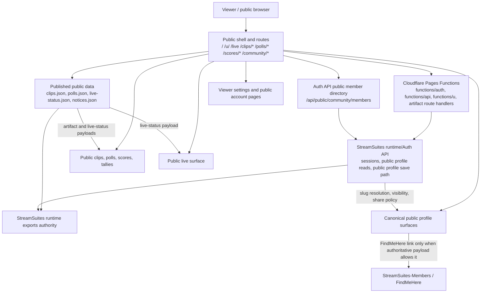

# StreamSuites-Public

Canonical public StreamSuites surface deployed to Cloudflare Pages at `https://streamsuites.app`.

## Release State

- Current Public milestone bucket: `0.5.4-alpha`; pending bucket: `0.5.5-alpha`. This redesign does not allocate or bump either value.
- Runtime-displayed version/build labels are consumed at runtime from `https://admin.streamsuites.app/runtime/exports/version.json`.
- `/version` is the human-readable diagnostic view of the canonical public `version-registry-public-v1` feed. It reads the feed through the existing same-origin `/api/public/*` Pages proxy and does not replace, cache, or become the authority for the source endpoint.
- `/status` is the canonical branded service-health view. Atlassian Statuspage public reads remain its official current-state, incident, and maintenance source. Runtime/Auth’s sanitized watchdog projection supplies secondary real component history, Core API Response Time history, and the canonical `overall-availability-v1` history. A valid stale projection remains visible as historical data through its snapshot time: current direct state becomes Watchdog offline, summary values remain labelled as-of the snapshot, and the trailing time to the browser clock is a presentation-only neutral unobserved span that is neither uptime nor downtime. Studio Room Readiness remains Deferred. Missing diagnostics with no retained server or session snapshot degrade to Atlassian-only mode; no state, history, availability, or metric value is fabricated. Runtime/Auth status synchronization and Statuspage mutation authority are unchanged.
- `/health` is the complementary public observability surface: it explains how measured StreamSuites paths are operating, while `/status` remains the place for user impact, incidents, maintenance, and subscriptions. Health consumes only Runtime/Auth’s same-origin sanitized `status-watchdog-public-v1` diagnostics and canonical `overall-availability-v1` current posture. Stale, absent, deferred, and provider-managed observations remain explicitly unknown; latency and 5H/24H/7D/30D heatmap cells render only when real watchdog buckets exist.
- Runtime/Auth remains the canonical system-version authority. The checked-in Public mirror may lag the authoritative runtime export until the established publication workflow refreshes it.
- This repo is not a canonical state authority. It renders authoritative runtime exports and Auth API responses.

## Scope & Authority

- This repo is the public-facing site shell for profiles, public artifacts, viewer-facing pages, and public live discovery.
- Same-origin Cloudflare Pages Functions proxy browser requests to the authoritative Auth API, but they do not move backend ownership into this repo.
- Canonical slug resolution, profile visibility, share URLs, and FindMeHere eligibility remain runtime/Auth-owned in `StreamSuites`.
- Public routes render authoritative runtime exports and Auth payloads; they do not mint competing profile or live-status truth.
- Public profile About sections render the Runtime/Auth-sanitized Markdown story and, independently, an optional validated YouTube, direct Rumble, or Vimeo embed or an uploaded MP4/WebM projection. Runtime/Auth's default-visible About flag can omit the entire visitor card and its navigation without deleting the owner's saved story/video. The browser reconstructs only the documented safe Markdown element set, never accepts raw embed markup, and keeps all video support presentation-only.

## Studio-First Public Identity

- The production `/` landing now presents StreamSuites as a connected livestream-production suite centered on Browser Studio and native StudioApp, with StreamSuites Studio for OBS as the separate OBS integration. Engagement, automation, alerts, overlays, profiles, progression, and public artifacts are connected capabilities around production.
- Browser Studio links to `https://studio.streamsuites.app`, remains closed-access and OFF AIR, and uses direct Cloudflare RealtimeKit browser media. Browser recording and broadcast output are not presented as shipped.
- StudioApp links to `/downloads/studioapp/`, remains a native Windows C#/.NET/WPF shell with a supervised C++20 media engine, and is explicitly not a WebView or browser wrapper.
- StreamSuites Studio for OBS links to `/downloads/obs-plugin/`, remains a plugin/integration rather than an OBS fork or replacement, and leaves scenes, mixing, composition, encoding, recording, and output inside OBS.
- Public Shell links to `https://streamsuites.app/clips` as the downstream public artifact surface. It does not capture, mix, encode, record, or output media.
- `/downloads/` is the searchable parent index for the current StudioApp, Studio for OBS, and Extensions surfaces. It presents only their published page-level status and routes; it does not create an artifact registry or download authority.
- Runtime/Auth remains the shared authority for identity, permissions, rooms, invitations, destinations, protected credentials, alerts, automation, exports, shared state, and canonical versioning. It is not the media path for Browser Studio, StudioApp, or OBS.
- `about.html` is now an editorial product-story page with the same product hierarchy and media-boundary explanation. Its existing manifest-driven consumer/developer records, stable anchors, expandable technical details, version/status hydration, and renderer hooks are retained; the three About JSON sources were refreshed to remove the obsolete three-repository/static-dashboard narrative.

## Shared Public Design System

- `css/public-fonts.css` is the local typography contract: Tektur for display headings, Blinker for body/UI copy, retained Geist Sans for existing heading fallbacks, and IBM Plex Mono for version, status, system, code, and compact metadata. Blinker uses the local fixed 100/200/300/400/600/700/800/900 faces with `font-display: swap`; refreshed surfaces use `font-synthesis: none`; no external font request or JavaScript font loader is required.
- `css/studio-first-landing.css` owns the approved `pocv9` production adaptation and its corrective pass. The hero atmosphere is deliberately weighted behind the left-side copy, with a denser DPR-capped particle field, visible fine links, and soft point halos above the grain layer. `Run it your way.` now uses only tonal variations of the active product feature color and eases between blue, lime, violet, or gold with the selected preview. Browser Studio and StudioApp restore the protected POC's direct stage composition exactly: the matching output background and safe area use the same 8% inset, Browser participants occupy the POC positions, and StudioApp uses the POC solo-output geometry without an extra production wrapper. The complete four-state device uses the POC perspective angle and gently straightens on hover. Production `index.html` uses a bounded presentation revision on the stylesheet URL so a newly deployed document cannot reuse the earlier landing stylesheet. The landing header and footer retain the first-party square `assets/logos/ssmainlogosq.webp` plus `assets/logos/wmnew.webp` lockup; the Creator Login destinations, dismissible access notice, auth modal, OAuth/email/password, Turnstile, legal, account-switch, and temporary bypass controls remain unchanged.
- `css/standalone-pages.css` extends that accepted landing token, typography, header, navigation, footer, focus, and reduced-motion contract across About, Donate, Support, Privacy, Roadmap, Accessibility, and the Version Reference without changing the download cascades. The retained pages use the exact landing mark-plus-wordmark treatment, normal-flow footer, bounded desktop gutters, and collapsible mobile navigation; page-specific composition remains scoped to the standalone body classes.
- Standalone hero titles use a restrained bounded scale, and every standalone footer repeats the exact square-mark plus `wmnew.webp` wordmark lockup used by its header. The production landing footer now uses that exact lockup as well. Donate retains the six established suggested amounts, their impact explanations, five funding-use areas, trust guidance, and local-only donor-message preview while keeping Stripe Checkout as its only network action. Roadmap percentages count once as each programme enters view; progress bars and programme cards add restrained hover/focus sheen, with immediate static rendering under reduced motion.
- `version.html`, `css/version-page.css`, and `js/public-version.js` provide a compact, polished technical presentation of all components returned by the live public registry, including semantic-policy distinctions, state, event summaries, compatibility posture, filtering, per-component copy, a complete human-readable copy action, and a direct jump from the diagnostic hero to the component directory. Deployment-identity clients visibly inherit the live system version with a `System aligned` chip rather than implying an independent product semantic line. The Release Manager is identified separately as a local diagnostic companion because Runtime/Auth deliberately does not project a separate Release Manager product version in the public feed; no private admin registry data, executable-local version, or fabricated fallback snapshot is placed in Public.
- `status.html`, `css/status-page.css`, `css/status-report.css`, `js/status-data.js`, `js/status-page.js`, and `js/status-report.js` implement the approved comprehensive status center. Atlassian’s public summary remains the official current-state and incident source; optional `GET https://api.streamsuites.app/api/public/status/diagnostics` data is clearly secondary. Valid stale server snapshots retain their component, Core API, overall, and report history while current direct badges become Watchdog offline; a failed diagnostics request may also reuse the last successful response in memory for that browser session, but local storage is not a history authority. Only a genuinely missing snapshot degrades to Atlassian-only mode. The finalized four parent groups and all 21 child components render without group records becoming cards. Each deliberate group section shows its role, accent, operational/total children, monitored, deferred, external/vendor, and attention counts; those group colours stop at the header marker, while component surfaces, borders, hover, expanded frames, and graphs use neutral graphite/steel/cyan treatment plus semantic state colour. Equal-height compact cards align meaningful local icons, long names, official state, exact official/direct/vendor/manual source labels, coverage, checks, latency, and expansion controls. Expanded rails separate official and direct summaries, align ownership/availability/check facts, preserve polished discrepancy/stale explanations, and provide accessible collapse controls. Real-history-only 5H/24H/7D/30D SVG graphs include selected ranges, screen-reader summaries, keyboard-focusable points, axis labels, last measured latency, observed state bands, internal missing-sample gaps, and a trailing neutral Watchdog offline span with no measured line, area, or operational rail. Summary percentages, downtime, coverage, min/average/max, and sample counts stay frozen to Runtime’s snapshot and never include that presentation span. The Core API custom metric is bound to its authoritative Authentication, Accounts & Sessions component history and the overview offers a direct expandable-history control. Deferred/manual and Atlassian vendor-managed cards show no fake graph; Studio Room Readiness remains explicitly deferred. Desktop, tablet, phone, short-height, long-name, focus, reduced-motion, and 125%-equivalent layouts stack without document overflow. `status.html` deliberately contains no widget host, widget stylesheet, widget controller, or automatic status slot; the widget on other Public pages now surfaces the same two custom metrics in compact form only when fully expanded and points users to the Status Center for historical ranges.
- The Status Center now presents Runtime’s canonical `overall-availability-v1` critical-path history as an explicitly watchdog-observed 5H/24H/7D/30D feature graph, including coverage, downtime, true unknown time, pre-monitoring time, and the Runtime-derived state rail without treating it as official Atlassian uptime. When stale, the last calculated overall summary remains labelled as-of the snapshot while current watchdog-derived overall state is unavailable and Atlassian remains current authority. One reusable accessible report modal produces complete or component-scoped `streamsuites-status-report-v1` exports from a presentation-neutral allowlisted model: dependency-free Canvas PNG pages, vector-oriented HTML/SVG print documents for Save as PDF, and formatted JSON downloads. Every stale export retains real component/Core API/overall history, explicit `fresh: false`/`stale: true` provenance, the last snapshot timestamp, and neutral trailing offline geometry where graphs support it; it never turns stale direct state into official status or recomputes canonical availability. Older diagnostics receive truthful unavailable states rather than browser-synthesized overall or 5H history. The existing report menu now remains beside each card’s diagnostics control in both collapsed and expanded states, uses a shaped chevron instead of a text glyph, opens inward above the footer, and shares the one modal; that lightbox uses narrow dark scrollbars on both the dialog and its viewport backdrop.
- The expandable diagnostics renderer is dependency-free native SVG/CSS/JavaScript rather than a chart package. It derives dynamic latency domains, smooth monotone curves, segmented gradient strokes, deliberately visible real-data area fills, compact current/min/average/max summaries, and operational state bands only from watchdog-observed buckets; a null latency or missing bucket remains an open gap and is never converted to zero, interpolated, randomized, or backfilled. Components with state but no meaningful latency receive a dedicated operational-history strip, while deferred/manual and Atlassian provider-managed components receive intentional explanatory states instead of placeholder charts. First expansion primes an unanimated hidden frame immediately but does not spend the animation while the plot is below the viewport; a bounded intersection trigger starts a 1.64-second left-to-right measured-line draw through a responsive SVG feather mask that extends safely beyond the final point, followed at the settled trailing edge by a short baseline-up area reveal, while the observability rail, gap labels, final point, and restrained tip glow complete within the same roughly 2.2-second sequence. The mask remains complete after entrance, so no dash cleanup can expose a previously clipped trailing section. Every 24H/7D/30D change uses its short outgoing fade, recalculates real geometry, and then replays the same in-view chart entrance without changing selected or keyboard semantics. Fine pointers inspect the nearest real bucket through a bounded crosshair and tooltip containing its exact timestamp, measured latency when present, state, and availability; touch retains the visible latest-value callout and simplified responsive axes without depending on hover. Sparse ranges retain one or two real points, sample counts, and an accumulating-history label. Screen-reader summaries, one focusable current observation rather than hundreds of tab stops, textual freshness/availability, arrow-key range navigation, immediate static reduced-motion rendering, and no document-level overflow remain part of the contract. No fake history or external chart dependency is included.
- Status graph presentation distinguishes plotted five-minute or daily aggregate buckets, latency-bearing buckets, raw probe observations, selected-range time before history began, genuinely missing internal intervals, and post-monitoring watchdog-offline time. Timestamps are normalized to the Runtime/Auth bucket interval before plotting, so adjacent observations remain one measured segment; pre-history remains empty with a restrained outline, internal gaps stop both line and area and use only a neutral dashed bridge, and a stale trailing period uses a neutral shaded span with no measured geometry or status bars. The observed-availability rail uses restrained state-colour vertical gradients only for real observations; no offline span contributes fake buckets or statistical weight. The latest point stays attached to the last real observation with a restrained halo. Group headings use short header-local accent rails; operational component frames remain neutral, while official degraded, partial-outage, major-outage, maintenance, and unavailable states tint the complete card frame, border, glow, and masked local icon glyph with their semantic colour. The existing hero composition keeps its approved blue-black atmosphere and steel/cyan/pale/violet feature-line gradient exactly for normal operations; an official non-operational posture recolours the animated ambient orbs, atmosphere, feature text, system-pulse frame, rings, routes, nodes, and authority hub to gold, orange, red, violet, or steel according to that official state. Operational hero and incident/maintenance empty states reuse the local `assets/icons/ui/tick.svg` mask, with the compact incident-header mark absolutely centred in its frame and offset by the measured visual centroid of the asymmetric tick artwork. The header hydrates its version through the same `js/utils/versioning.js` plus `js/utils/version-stamp.js` mechanism used by other standalone Public pages, including the established unavailable fallback rather than a hardcoded value. Motion-enhanced decoration becomes a complete static composition under `prefers-reduced-motion`, and the polished incident/maintenance cards preserve their real-event renderers and responsive two-column-to-stack behavior.
- Status component icon mapping reuses the existing Studio, StudioApp, OBS, Creator, Admin, Developer, Stripe, GitHub, and generic UI assets. New current-color generic `assets/icons/ui/status-cloud.svg`, `status-envelope.svg`, and `status-bell.svg` cover concepts for which no suitable local generic icon existed; no external company logo was redrawn.
- `css/status-widget.css` and `js/status-widget.js` replace the earlier reduced impacted-component tooltip with the approved floating rounded-square signal, hover/focus summary chip, plus/cross control derived from the existing UI assets, and complete all-component detail panel. The signal clips its own pulse and the idle toggle has no rectangular backdrop blur. The widget uses RAF-bounded footer geometry and a 12px design clearance so it rises above the lowest visible footer, then returns to its normal safe-area offset. The standalone `/u` profile preserves its pre-existing explicit inline slimline-footer mount while receiving the same upgraded data and panel. Stale refreshes retain only the last successful in-memory read; a first-read failure is shown as unavailable, never operational.
- Public page-view reporting remains centralized in `js/public-page-visit.js`, loaded through the shared shell/status paths rather than copied into individual documents. It now sends only `surface`, a normalized route family, and an ephemeral event ID to the existing Runtime endpoint; a 30-second route-local browser guard controls reload/query/hash duplication, Beacon remains first choice, and bounded keepalive failure never blocks rendering. Titles, referrers, account/session data, query strings, profile slugs, and artifact IDs are not sent for Stats.
- `css/theme-dark.css`, `css/public-pages-v2.css`, and `css/public-shell.css` carry the cooler near-black graphite/steel/blue identity, selective cyan-indigo and purple depth, typography roles, focus language, layered cards, forms, tables, dialogs, loading/empty/error treatment, responsive spacing, and reduced-motion behavior across support, legal, auth, account, Public Dashboard, gallery, profile, and feature routes. The functional shell now uses a bounded 1540px content track, larger hero and section hierarchy, less fragmented dashboard grids, clearer selected navigation/filter states, and restrained entrance/hover motion.
- `js/studio-first-landing.js` owns keyboard-accessible four-state product tabs, the default-on ten-second product loop, its four-dot switcher and play/pause control, gentle preview crossfades, ecosystem preview selection, the dismissible Alpha notice, mobile navigation, sticky-header progress, bounded hero particles, fine-pointer parallax/glow, visibility-aware authority-route sequencing, and progressive-enhancement reveals with reduced-motion fallbacks. Alpha-notice and active restricted-access dismissals now apply only to the current document; stale session dismissal keys are cleared so required notices return on reload instead of flashing and then disappearing. The hero feature line uses only the active product color in a light-tint, full-midtone, and subtly darkened progression, so its near-white end never becomes entirely colorless. The loop pauses while the page or hero is not visible and is disabled when reduced motion is requested. It does not own auth, status, version, access enforcement, canonical state, or any product media path.
- The ten-second product/feature-colour loop is explicitly landing-only: it requires the production root `data-product` marker, multiple real product tabs, and the cycle-control group before it may set or advance a product state. Standalone About, Donate, Roadmap, Support, Accessibility, Privacy, and Version pages use a bounded controller revision and keep their default Public-blue tokens while continuing to reuse the landing shell controller for navigation and reveal behavior. Their blue header CTA, and the independent `/health` CTA, explicitly retain the established dark foreground. `/health` remains outside the product-colour controller and retains only its meaningful operational/degraded/outage/maintenance/unknown state colours.
- `css/download-surface.css` now gives the Downloads index, StudioApp, OBS, and Extensions routes the same graphite/steel foundation, feature-accent title gradients, legible dark-on-accent actions, supplied platform-icon masks, restrained entrance/hover motion, and reduced-motion/forced-colors fallbacks. Product-specific styles keep accent color to trim and diagram details rather than applying a whole-page color wash. The active download subnavigation border follows each surface's feature color—blue for Downloads, green for StudioApp, violet for OBS, and blue for Extensions. StreamSuites Studio for OBS product headers and cards across the download pages use the dedicated `assets/icons/icon-obsextension.webp` mark. All three product mock-window titlebars use the same `icondiag-studioapp.svg` glyph while retaining their page-specific feature colors: lime for StudioApp, violet for OBS, and blue for Extensions. The generic OBS glyph continues to identify OBS-owned output and platform-action semantics. Their real manifest/catalog clients, fail-closed gates, HMAC/cookie boundary, controlled redirect, extension schema, and route handling remain intact.
- `css/feature-edges.css` is the shared, tokenized Status-style footer-edge language. It preserves the Status footer geometry—a 34% segment at left 10% and one CSS pixel—without adding a feature-color edge to shared headers and without loading on Status or duplicating its page-owned pseudo-elements. Footer anchors retain explicit paint order, visibility, and color transitions after scrolling; the landing maps the token to the active product state (blue Browser, lime StudioApp, violet OBS, gold Public). Downloads inherit their existing product variables; Public shell/artifact pages use their established cool blue; standalone, legal, support, login-entry, and general pages use their established accent or canonical Public blue. OAuth callbacks, auth bridges, redirect shims, diagnostics, generated/machine surfaces, Functions, overlays, fixtures, archives, POCs, and build output are outside this rollout.
- The product-family section contains the same four surfaces represented by the hero. Its subdued `01`–`04` identifiers sit in each card's top-right corner without creating a blank upper band. `04 StreamSuites Public` uses the established gold accent and the existing `/clips` route, and describes only current Runtime/Auth-backed clips, polls, wheels, tallies, scoreboards, profiles, economy, leaderboards, and progression surfaces. It does not claim capture or media-engine ownership. The grid is four columns only at very wide desktop widths, two-by-two on ordinary desktop/tablet layouts, and one column on narrow screens.
- The supplied Profound, Halo, Backlog, Wope, and Evervault pages were used only as visual research for atmosphere placement, restrained glow, horizon depth, and edge treatment; no wording, asset, component, route, or interaction was copied into production.
- Responsive layouts are explicitly defined for desktop, tablet, short landscape, and narrow mobile widths. A stored expanded desktop sidebar preference is presented as the compact icon rail on narrow viewports without overwriting the user's desktop preference. Skip links, visible focus states, semantic tabs, keyboard arrow navigation, Escape handling, reduced-motion fallbacks, bounded content widths, readable long-form line lengths, and non-destructive card/route motion are part of the shared treatment. Under reduced motion, radiance, auroras, particles, gradient drift, autoplay, preview crossfade/float/glints, floating signals, and topology animation stop while the complete static atmosphere, output, topology, controls, and footer edges remain visible. In normal motion, the canvas remains singular, capped at DPR 1.5 and bounded to 54 mobile or 96–156 desktop particles plus 44/144 links and 2/5 curved signal pulses, and pauses while offscreen or document-hidden; inactive preview animation is paused. The central Runtime/Auth card, ports, icon, and orbit ease to the currently routed Browser, StudioApp, OBS, or Public color as each corresponding topology pulse feeds it.

## Repo-Scoped Flowchart


```mermaid
flowchart TD
    Viewer["Viewer / public browser"] --> Shell["Public shell and routes<br/>/ /u/<slug> /live /clips/* /polls/* /scores/* /community/*"]
    Shell --> Functions["Cloudflare Pages Functions<br/>functions/auth, functions/api, functions/u, artifact route handlers"]
    Shell --> Data["Published public data<br/>clips.json, polls.json, live-status.json, notices.json"]
    Shell --> AuthDirectory["Auth API public member directory<br/>/api/public/community/members"]

    Functions --> Auth["StreamSuites runtime/Auth API<br/>sessions, public profile reads, public profile save path"]
    Data --> Runtime["StreamSuites runtime exports authority"]
    AuthDirectory --> Auth
    Auth --> Runtime

    Shell --> Profiles["Canonical public profile surfaces"]
    Shell --> Artifacts["Public clips, polls, scores, tallies"]
    Shell --> Community["Viewer settings and public account pages"]
    Shell --> Live["Public live surface"]

    Auth -->|slug resolution, visibility, share policy| Profiles
    Data -->|artifact and live-status payloads| Artifacts
    Data -->|live-status payload| Live
    Profiles -->|FindMeHere link only when authoritative payload allows it| Members["StreamSuites-Members / FindMeHere"]
```

## Current Surface Model

- `/` is the Studio Command Center landing with real product routes, four equal-footprint illustrative preview states, product-specific media ownership, a five-node Runtime/Auth authority topology, connected Public capabilities, restrained motion, wider ecosystem links, and hydrated status/version metadata. Its original `/auth/access-state`, `/auth/session`, OAuth/email auth, Turnstile, access-code, lockout-banner, and creator-routing contracts remain in place. The landing and shared Public-shell login modals use the first-party square `assets/logos/ssmainlogosq.webp` brand mark.
- `/about.html` is the full product story plus the existing manifest-driven technical record.
- `/donate.html` preserves the existing one-time StreamSuites billing endpoint and Stripe Checkout handoff while presenting truthful integer amount validation, busy/error states, and payment/account boundaries. `/donate-success.html` and `/donate-cancel.html` remain the configured return surfaces.
- `/support.html` presents verified documentation, account, troubleshooting, donation, incident, and Discord pathways as distinct feature-icon cards with scoped accent treatments and accessible reduced-motion behavior. Its custom read-only Discord community card consumes Discord's enabled public guild-widget JSON directly, safely renders published presence and visible voice channels, preserves the verified support-channel deep link, and keeps a server-rendered Join action available even when live presence cannot load. Its future first-party ticket-centre form/history structure is explicitly disabled and performs no submission, upload, persistence, account lookup, or ticket-state work.
- `/privacy.html` preserves the February 22, 2026 policy text and date in a long-form reading layout with a responsive section index and stable anchors. `/accessibility.html` describes current practices and limitations without claiming audit, certification, or formal conformance.
- `/roadmap` is the canonical public programme roadmap. Eight conservative integer estimates replace the former implementation-entry inventory, while detailed release changelogs link to verified StreamSuites Docs routes.
- `/version` is the canonical human-facing master version reference. It renders all 13 components currently returned by the authoritative public registry, keeps null/deferred/uninitialized states explicit, and falls back to a truthful unavailable state rather than stale or hardcoded version data. Copy actions produce readable diagnostic text rather than exposing raw JSON.
- `/status` is the primary StreamSuites human-facing service-health route. It preserves Atlassian as the public data source, hosted archive, and subscription destination while providing the complete branded component, incident, maintenance, history, freshness, and transparency presentation. The route follows the same extensionless Pages convention as `/version`; `status-check.html` remains a separate widget diagnostic surface.
- `/health` is the technical sibling of `/status`. Its Runtime-authoritative overview, public-safe topology, grouped component matrix, freshness and current-response views, external-dependency boundary, and real-sample heatmap are presentation-only; it does not probe infrastructure or derive a competing canonical state in the browser.
- `/downloads/` is the searchable parent download index. Its three checked-in records route to StudioApp, Studio for OBS, and Extensions and mirror only truthful static page status; Browser Studio is explicitly presented as a no-install external surface.
- `/downloads/studioapp` is the canonical Windows StudioApp ALPHA landing page. Its same-origin `/api/downloads/studioapp/release` metadata seam remains visible while download access is locked, validates strict schema-v2 `product-manifest.json` with bounded schema-v1 fallback, treats independent StudioApp product version/build as primary and optional StreamSuites system compatibility as secondary, and never uses Runtime `version.json` as installer identity. Only an authorized short-lived session enables the separate controlled redirect; the static page and metadata response contain no raw installer URL.
- The StudioApp page shows macOS and Linux as disabled Coming Soon release/requirements scaffolds with no version, build, date, package size, compatibility, or artifact claim. The Windows storage guidance references the manifest-hydrated installer size plus installation/update headroom and separate media storage instead of inventing an unsupported fixed minimum.
- Download lockout is configured only through Pages environment values (`DOWNLOAD_ACCESS_LOCKED`, `DOWNLOAD_ACCESS_MESSAGE`, `DOWNLOAD_BYPASS_ENABLED`, secret `DOWNLOAD_BYPASS_CODE`, bounded `DOWNLOAD_BYPASS_TTL_MINUTES`, and `SHOW_DOWNLOAD_LOCKOUT_BANNER`). Approved tester access uses a short-lived HMAC-signed HttpOnly/Secure/SameSite cookie scoped to the download API. Failure to validate access, cookie, or manifest keeps the download unavailable.
- `/downloads/obs-plugin/` truthfully presents **StreamSuites Studio for OBS** as in development. It publishes no artifact, version, release date, or compatibility claim; Runtime/Auth remains the control authority and OBS owns the media pipeline.
- `/downloads/studioapp/extensions/` is a searchable directory shell backed by the versioned, intentionally empty `data/studioapp-extension-catalog.v1.json` presentation contract. Public is not an extension registry: future listings must come from Runtime/Auth or an authoritative generated export, and the current catalog contains no installable item or executable-download field.
- The public `/home` and `/community` experiences now share one dashboard-style shell and one sidebar/navigation model, with the main Dashboard group listed before Production, `/home` remaining the default public home tab for the public dashboard, and `/media` preserved only as a compatibility entry. The shell brand uses the existing `assets/icons/ui/streamsuites-filled.svg` silhouette as a CSS mask with rest/hover gradients derived only from the separate Public-shell theme; it does not read or alter profile-owner theme state. Production links use `icondiag-studioweb.svg`, `icondiag-studioapp.svg`, and the mask-safe `obs-0.svg`. One state-aware control advances the sidebar through expanded, icon-only, and hidden states and persists the selection. The title and subheading chip use Tektur at bold and regular weights respectively, while authenticated account-overview values use a system-monospace stack. Follow-up rendered evidence is retained under `output/playwright/public-shell-followup-20260817/`.
- Canonical public profiles resolve at `/u/<slug>`, backed by the authoritative public slug model exported by `StreamSuites`. The standalone route uses a theme-complete adaptive presentation: a fixed glass header that strengthens on scroll, a pinned cover that fades beneath the identity card, a compact hero `Edit profile` affordance, and the exact Overview, optional About, Identity, Watch, Clips, Artifacts, Platform Presence, Share Profile, and Safety order. The section rail follows Bio, optional About, Identity, Watch, Clips, Artifacts, Presence, and Safety; Watch owns canonical `#watch`, while `#media` and the retained legacy stream hashes resolve to it without losing the current route query. Watch retains the latest stream and real secondary-source tray; Clips separates channel-owned work from clips created by the profile using authoritative provenance; Artifacts owns progression, wallet, inventory, scoped boards, and filtered non-clip published work. Collapsible sections are keyboard-operable, inert while closed, and use vertically centered metadata/toggle controls with no residual closed-panel spacing. Appearance separates the persisted `dark`/`light` neutral tone from the persisted accent theme, defaults to Dark plus Violet Blue, and lets every accent preset compose with either tone. The existing Page style editor exposes both axes; an owner-only tone shortcut sits inside the existing account dropdown rather than adding another header control. Theme tokens cover accents, tone surfaces, focus, dividers, rails, buttons, the account control/menu, page scrollbars, editor chrome, nested panels, and modals without becoming authority, while the detached status widget keeps its neutral scrollbar. Stable image media uses the direct query-free Runtime/Auth version URL under the strict same-origin `/profile-media/u/...` Pages transport; exact legacy CDN/API version paths normalize once to that canonical URL and are never retried through alternate origins. The transport accepts only exact immutable paths, strips browser credentials/fingerprint headers, validates Runtime's WebP signature before returning the stream, and rejects query strings, HTML/challenge bodies, unsupported types, private/arbitrary hosts, data/blob values, and traversal. One genuine image failure produces the designed fallback; an owner-only replacement diagnostic becomes available without creating another fetch loop.
- The authenticated standalone-profile account dropdown uses the shared project typography, a discreet self-email subline when Runtime/Auth provides one, restrained small uppercase table labels, a compact identity table for display name, user code, account type, and tier, the canonical SVG-backed tier chip, and masked SVG prefixes for every available account action. The email replaces the redundant header account-type repeat and is never sourced from another user's public profile. Its owner-only appearance shortcut labels the active state directly as `DARK MODE` or `LIGHT MODE` while preserving the existing value, switch, and persistence behavior. On the authenticated owner's own profile only, `Customise profile` replaces the redundant self-profile link and opens the existing editor directly at Page style; other-profile views retain the normal `Profile` destination. The profile-page developer-capable slot links to Web Studio instead of Developer Console, while shared account menus elsewhere retain their existing console destination. Runtime/Auth remains the sole source of the displayed identity, entitlement, ownership gate, and capability-aware destinations.
- The non-collapsible Public Overview is a compact two-tier snapshot: exactly three primary metrics for Artifacts, Clips, and Inventory sit above a continuous semantic detail surface for Profile type, Tier, Joined, and Balance. Artifact totals include the deduplicated first-class clip subset exactly once, and Polls/Tallies are not promoted into competing Overview cells. About keeps story before media in the DOM and mobile flow, places a small provider icon on the discreet watch link immediately below the player, and uses a real separate footer row. Watch starts expanded even when its authority state is empty; Artifacts and Safety start collapsed. Artifacts presents XP/rank beside the current level, a static accessible theme-derived progress meter, sibling wallet and inventory panels, a separate owner exchange panel, contained scoped-board overflow, and filtered non-clip gallery pagination. Primary actions and the masked header emblem use distinct static rest/hover gradients derived from the selected theme, including darkened Frosted Silver stops rather than near-white animation endpoints.
- The owner editor uses one non-duplicated section control: its sticky sidebar becomes a compact sticky row at narrow widths, scrolls the internal editor body without changing the page hash, and tracks the section currently in view with matching active and accessible state.
- The owner editor's Social links section renders only currently defined destinations as compact URL detail cards. `Add link` opens the unused standard-platform icon menu plus a repeatable Custom link action; standard platforms stay single-instance, while up to six custom destinations may carry an optional SVG, PNG, BMP, or WebP icon beneath that custom card and otherwise retain the established fallback icon with a dark-theme-safe light treatment. Custom links are saved only through Runtime/Auth and join the visitor-facing platform-presence gallery.
- The About corner silhouette uses the supplied `assets/logos/ssmotfinew.webp` artwork at the established size, opacity, and position; the main site brand continues to use `ssmainlogosq.webp` where already documented.
- The latest local profile/editor evidence is retained under `output/playwright/`, including `profile-account-menu-dark-desktop.png`, `profile-account-menu-light-desktop.png`, `profile-account-menu-dark-mobile.png`, `profile-tone-dark-desktop.png`, `profile-tone-light-desktop.png`, `profile-tone-light-mobile.png`, `profile-tone-owner-dropdown-light.png`, `profile-tone-editor-dark.png`, `profile-tone-editor-light.png`, `profile-tone-editor-light-mobile.png`, the theme/framing captures, and `profile-media-polish/owner-editor-social-defined-1060x640.png`, `profile-media-polish/owner-editor-social-add-menu-detail.png`, `profile-media-polish/owner-editor-social-custom-link-1060x640.png`, and `profile-media-polish/owner-editor-social-custom-link-390x844.png`. These are deterministic browser-validation artifacts, not deployed profile content or live-provider acceptance.
- Legacy `user_code` compatibility is still preserved during profile resolution and migration-safe routing.
- Clean public artifact routes are supported for clips, polls, and scores via `/clips/<id-or-slug>`, `/polls/<id-or-slug>`, and `/scores/<id-or-slug>`, while legacy detail entry points remain available.
- `/community/settings.html` is the viewer/public account profile settings surface and loads or saves supported authoritative fields through the public profile API.
- `/community/my-data.html` now reads the signed-in user’s real public XP/level progression from `/api/public/progression/me`, wallet/inventory state from `/api/public/economy/me`, and public-authority request history from the authoritative `/api/public/authority/requests/mine` contract.
- `/wheels` remains the canonical public route for Runtime/Auth-owned wheel artifacts and wheel sets; `/scoreboards` remains the legacy list-view lens over that same authority, while `/leaderboards` reads the public progression leaderboard. Public hydration stays API-first against `/api/public/wheels`, with shared-state/runtime-export copies only as fallback mirrors and the existing single artifact-level `wheel.changed` SSE subscription driving refetches—never one stream or polling loop per child wheel.
- `/wheels` is the Wheel Library and Public Gallery. Each has accessible `Wheel Sets` and `Wheels` tabs backed by one bounded list projection: owned private Sets remain owner-only, public Sets remain visible even when they are also yours, and individual Wheel cards always identify and open their canonical parent. Shared cards use actual palette-driven static SVG mini wheels, theme-aware compact 3–4/2/1-column layouts, keyboard-focusable card links, and no duplicate Workspace/Stage/Popout buttons. Search applies to the active collection; network failure remains distinct from an empty result.
- Owned Set and child-Wheel card menus expose `Edit Wheel Set details`, as does the workspace More menu. Manage Wheels begins with a separate `Containing Wheel Set` title/description editor above the child-Wheel controls. All Set identity changes use the canonical artifact PATCH and rehydrate Library/Gallery state; a Set title is independent from every child Wheel name, which changes only through an explicit child rename operation.
- The workspace Focus/Grid/Results view selector uses the supplied wheel-pie, wheel-grid, and wheel-results SVGs as compact icon-only tabs. Accessible names, native tooltips, active selection, and keyboard focus remain present while the production toolbar uses less horizontal space.
- Eligible Focus-wheel slices are direct pointer/keyboard entrant controls: selecting one updates the current-entrant overlay and Entries inspector without creating a backend result. Visible idle Focus/Grid discs drift at a bounded 0.75 degrees per second, pause for pointer/keyboard interaction, and stop for spinning, animation-disabled configuration, or reduced motion. The centre hub is an accessible spin button that uses the same existing eligibility, ownership, popup, winner-limit, and local-result gate as the toolbar Spin action.
- Wheel Library and lifecycle primary/secondary actions are styled by narrowly scoped Public-shell theme rules, including hover, keyboard focus, disabled, and narrow-layout states. The list route does not load the full Wheel Workspace stylesheet merely to style Create, Import, or modal actions.
- The primary actions are `Create` and `Import`. Create offers `New Wheel Set` and `Add Wheel to Existing Set`; an individual Wheel is never created as an orphan. Import presents complete `Stage / Wheel Set (.stg)` and `Individual Wheel (.swl)` choices, with legacy `.sswheel` described only as import compatibility. A `.stg` always becomes a new owned Wheel Set; a `.swl` can be added to an existing owned Set or become the first child of a new Set.
- `js/wheel-api-client.js` is the one credentialed client for wheel creation, owned listing, artifact/child mutations, canonical export/import, and centre/Stage media uploads. It honors an explicitly injected Runtime/Auth base and uses `http://127.0.0.1:18087` for local Public acceptance. Production browser requests use the existing same-origin Pages transport; its narrow allowlist now includes only `/api/creator/wheels` and descendants in addition to public API routes, then forwards cookies and request bodies to Runtime/Auth without moving authority into Public. This keeps the authenticated browser session first-party and avoids the cross-origin failure that made valid owned/public Wheel Sets appear unavailable. JSON, multipart, non-JSON, HTML, network, and cancellation failures normalize to safe wheel errors before editor code sees them.
- Public now renders the versioned multi-wheel projection through `js/wheel-workspace.js`, the single shared implementation used by both the normal detail route and shell-free Stage route. Runtime/Auth's stable `active_wheel_id` selects the initial child; when multiple children exist, the Stage title card becomes the stable-ID keyboard selector. Focus, paged Grid, and combined Results views render only the visible wheel presentation. Spin All schedules the authoritative bounded stagger delay, guards stale runs, and produces one final celebration after every child result is ready. The obsolete embedded Wheel Detail renderer/editor fallback was removed from `js/public-pages-app.js`; the Public app now only orchestrates the shared workspace.
- Canonical child entrants use separate ticket `entries` and independent `weight`; eligible probability is `entries × weight` over the eligible total, and disabled entrants do not enter the draw. The owner editor writes the active child's settings back inside the existing authoritative wheel-set PATCH document while artifact title/description/default view/share slug remain artifact-level. Temporary result state is keyed by the stable child wheel ID and stays browser-session-local.
- The accepted `wheelpocv3` presentation remains intact inside the multi-wheel workspace: cinematic bounded arena, premium chassis/pointer/hub treatment, radial labels, focus-managed winner reveals, and a compact inspector beside the stage. The former hero, permanent owner-management row, separate full-width play rail, and separate wheel-selector deck are gone. One slim production toolbar stays above the arena, while the compact Stage title card exposes the child-wheel dropdown only when needed. Spin, contextual Re-spin, Spin All, Focus/Grid/Results, and Pop Out remain immediate; owner Add/Manage/contextual default plus browser-local resets live in the accessible More menu. Owner-only dedicated lightbox workspaces continue to handle wheel management, entrants, appearance and canonical centre-image upload, celebration, sound, rules, and share/presentation settings without moving authority into Public.
- Milestone 2.2 restores that V3 depth across Focus and Grid with layered chassis, groove, marker/light rings, reflective trim, dimensional hub/pointer, and radial slice treatment. Slice names are rotated 90 degrees from the tangent and normalized upright so they run lengthways inside each wedge. The title is a collapsible Stage overlay and accessible multi-wheel dropdown; the 320px inspector collapses to a real 44px rail and returns the released width to the arena; the wheel, disc, hub, pointer, and chamber retain one measured centre axis. Current entrant and selected/winning entrant detail remain browser-local presentation state.
- Appearance exposes exactly four Runtime-normalized system backgrounds (`Cinematic Chamber`, `Aurora Vault`, `Prism Grid`, and `Eclipse Halo`) plus one Custom image choice. Owners can preview the full Stage, tune the tint, and upload/replace/remove a custom image through Runtime/Auth's authenticated media boundary; Public revokes temporary object URLs and only rehydrates query-free immutable Runtime media. Blinker is inherited through the shared body token for controls and utility copy, while established display headings and radial wheel labels retain their deliberate display treatments.
- Owner mutations parse Runtime's structured failures, rehydrate directly from the canonical response without stale camelCase fields shadowing saved snake_case data, and preserve stable-ID selection plus browser-local results for surviving children. Open editors defer the one artifact-level SSE rerender until close, so save feedback and multi-action management remain usable while the refreshed canonical state is still applied. `Export Stage (.stg)` carries the complete Wheel Set; `Export wheel (.swl)` and `Import wheel (.swl)` live in Share/Presentation and Manage Wheels. Legacy `.sswheel` is never exported. Local loopback media URLs are accepted only for isolated QA, while normal persisted media stays query-free under the Runtime boundary.
- Individual cards use `/wheels/<parent>?wheel=<stable-child-id>`. The shared workspace validates that child locally, falls back to the saved default for an invalid/missing ID, updates selection/history without sending `set_active`, and preserves the query across reload. Stage remains automatic on the parent; its Popout/Dock controls stay inside the workspace.
- Winner celebration uses one bounded canvas only while the winner overlay is open: palette-driven confetti plus optional fireworks run for at most 6.6 seconds and clean up on dismissal. Reduced motion or disabled animation skips the canvas while retaining the accessible winner dialog. Results remain local to the browser and are never written as Runtime winner history.
- `/wheels/<artifact>/stage` is a purpose-built shell-free presentation route with no Public navigation, account chrome, footer, status widget, owner editors, inspector, or management overflow. Its reduced toolbar retains selected-wheel identity, Spin, contextual Re-spin, Spin All, Focus/Grid/Results, and Dock/Open Full Page. A parent-opened named Stage popup shares one browser-local session through an artifact/session-keyed `BroadcastChannel`; the parent disables competing play controls, restores them on Dock or manual popup close, and leaves blocked popups safely docked. Directly opened or independently embedded Stage instances remain independent local sessions; results are not backend history or cross-device synchronization. Cross-process/OBS/Studio synchronization is reserved for a future authoritative synchronized-session milestone.
- Original Milestone 2 evidence remains under `output/playwright/wheel-milestone2-20260817/`. The Milestone 2.1 compaction harness and deterministic desktop/tablet/mobile captures are retained under `output/playwright/wheel-compaction-20260817/`; they cover Focus/Grid/Results, owner/visitor, 1/6/12 wheels, contextual overflow, reduced-motion Spin All, popup/dock, and the Stage route. The stabilized 1440×900 shell-to-stage measurement fell from 423px in the captured before-state to 138px after compaction. These fixtures are local visual-validation data, not deployed Runtime or production-write evidence.
- Milestone 2.2 corrective evidence and its rerunnable installed-Edge harness are retained under `output/playwright/wheel-milestone22-20260817/`. It records the full geometry/collapse matrix, desktop/mobile Focus and Stage, all four presets, custom-background preview, Grid signature, entrant states, reduced motion, popup/dock, and clean local route smoke checks. These deterministic fixtures validate local rendering only; they are not deployed Runtime, clean-machine, or production-write evidence.
- Complete lifecycle evidence is retained under `output/playwright/wheel-lifecycle-20260817/`. Its local Playwright harness uses an isolated temp-root Runtime account to cover signed-out/empty/owned galleries, create, every owner editor and child-wheel operation, media, canonical export/import with new identity, Runtime restart persistence, post-restart editing, structured failures, stale-Runtime gating, and desktop/tablet/mobile layouts. It is local acceptance evidence, not deployed-service or production-data proof.
- Wheel Library/package/celebration evidence is retained under `output/playwright/wheel-library-20260817/`. The rerunnable installed-Edge harness uses an isolated temp-root Runtime to exercise Wheel Set and child cards, stable deep-link reload, `.stg`/`.swl` export/import destinations, legacy compatibility, restored winner confetti/fireworks, Dark/Light desktop and responsive tablet/mobile layouts, and persistence across an isolated Runtime restart. Focused action-style proof is retained there as `16-fixed-wheel-actions-dark-1440x900.png`, `17-fixed-wheel-actions-modal-1440x900.png`, `18-fixed-wheel-actions-mobile-390x844.png`, `19-fixed-wheel-actions-light-focus-1440x900.png`, and `button-style-qa.json`. These captures and portable fixtures are local validation artifacts, not deployed-service content or production-data proof.
- Standalone and in-shell public profile surfaces now consume the runtime-published public authority identity summaries so profile claim, assignment, issue, and removal requests submit against real `identity_code` targets instead of placeholder payloads.
- Public profiles render dual share behavior truthfully: StreamSuites links always use the canonical slug URL, and FindMeHere links render only when the authoritative payload marks the account eligible and visible there.
- Live badge, live ring, live-directory cards, and live profile-banner treatment consume the centralized runtime `live_status` export first. Individual `/u/*` profiles render the normalized latest/current livestream in the PlayViewer area when Runtime provides safe embed/source fields, and render the slim recent stream tray from real recent rows, Runtime `tray_sources`, or the current/latest source record. Ended Kick evidence stays a recent poster/source-card fallback without a live-only `player.kick.com` iframe. Optional Rumble discovery enrichment is used only when the existing UI needs missing watch/title metadata.
- `/live` is the dedicated public live view and only lists creators whose StreamSuites public profile is currently eligible and visible.
- Reserved media fields are reflected from the authoritative payload, including cover or banner usage plus reserved `background_image_url`.

### Public shell appearance and statistics

- Every route rendered by the persistent Public application shell now shares one semantic surface/text/border/accent/state token system, a compact desktop sidebar, icon-only collapsed rail, compact top bar/footer, and route-specific composition for dashboard, artifact, leaderboard, economy, live/community, settings, my-data, and non-wheel detail views. One state-aware control advances the persisted sidebar through Expanded, Icon-only, and Hidden instead of exposing separate resize and visibility buttons. Existing route resolution, API/data hydration, filters, dialogs, ownership gates, and Wheel Detail V3 behavior remain in their established renderers.
- Shell appearance has two independent axes: `dark` or `light`, plus one of the twelve established StreamSuites accent presets. `js/public-ui-preferences.js` applies the versioned browser mirror before shell CSS loads to avoid a default-theme flash. Signed-out visitors use that local preference; after authentication, Runtime/Auth's `/api/public/me` projection is authoritative and `POST /api/public/me/preferences` is the only signed-in save path. Failed authenticated writes roll back the optimistic preview and do not replace the last authoritative browser mirror.
- The shared account dropdown exposes a compact Dark/Light control and links to the full Appearance panel on `/community/settings.html`. The Settings panel is available to Viewer, Creator, and Admin accounts without moving profile fields or account authority into Public.
- Shell appearance is deliberately separate from the standalone `/u/*` profile's owner-configured tone and theme. Visiting or editing a profile does not overwrite the viewer's Public-shell preference, and changing the shell does not mutate a profile presentation.
- `/stats` remains the premium standalone aggregate view backed only by `GET /api/public/stats`. It retains the bounded account/profile/artifact totals, role counts, UTC monthly creation series, standalone chrome, Dark/Light preference, finite line/area entrance, point focus/hover, and reduced-motion rendering. The additive v2 projection now hydrates recorded Public/Creator/Browser Studio page views with all-time and rolling 24h/7d/30d values, a real 30-day combined daily graph, truthful coverage annotation, assigned public identities, enabled profiles, and authorized StudioApp Windows x64 manual download starts. Download starts are not called installs; Active Installations, vague Runtime Events, and milestone timestamps remain visibly unavailable. Each subsource fails independently and a top-level failure still renders chrome without substituting zero.
- Isolated local `/stats` evidence is retained under `output/playwright/stats-hydration-20260817/` for the exact clean route, all five required desktop/tablet/mobile viewports, populated Dark/Light data, independently unavailable downloads, measured zero-yet coverage, total endpoint failure, and reduced motion. These captures use isolated Runtime data and are not deployment or production-traffic proof.
- Local browser evidence for this milestone is retained under `output/playwright/public-shell-20260817/`: all 23 shell renderers in both appearances at 1366×768, representative 1920×1080/1024×768/768×1024/390×844 captures, four non-default theme combinations, signed-out and authenticated account menus/settings, collapsed/mobile sidebar states, Stats desktop/mobile/reduced-motion/keyboard-tooltip states, and the three Production navigation targets. Runtime/API values used for local visual verification are deterministic aggregate/session fixtures; those captures are not deployed Runtime or production-write evidence.

### Route treatment for this milestone

- Fully redesigned expressive surfaces: `/`, `/about.html`, `/donate.html`, `/support.html`, `/privacy.html`, `/roadmap`, `/version`, `/accessibility.html`, and the presentation-only `404.html`. Download implementations remain visually protected reference surfaces.
- Visually harmonized functional surfaces: `/home`, clips, polls, wheels, tallies, scoreboards, leaderboards, games/economy, market exchange, `/live`, community pages, and settings/my-data through the shared `public-shell.css` and existing renderer code. Standalone `/u/<slug>` profiles retain that renderer and shared contract while applying the dedicated route-local `public-profile.css` presentation layer.
- Visually harmonized quiet utility/information surfaces: login/auth pages, requests entry pages, resources, stats, terms, and postmortem through the existing shared page styles. The obsolete rendered Tools page is removed; the former Changelog page is replaced by Roadmap.
- Purpose-built download surfaces: `/downloads/`, `/downloads/studioapp/`, `/downloads/obs-plugin/`, and `/downloads/studioapp/extensions/`; their polished diagrams, search/catalog treatments, platform states, and feature trim share one download-specific system while preserving each route's real behavior.
- Intentionally excluded from production mutation: auth callback/bridge shims, overlay/browser-source surfaces, generated exports, functions/data artifacts, fixtures/samples, archived `index-v2.html` plus `css/aurora-landing-v2.css`, the `sspoc1` reference, the approved read-only `pocv9` reference, and preserved ZIP archives.

### Landing and feature-edge corrective validation

Human-facing coverage is inventoried in `tests/public-feature-edges.test.mjs`: landing/marketing; the generated Public application shell and artifact, community, live, profile, economy, and statistics entries; downloads; standalone information/support/legal pages; login entry pages; and 404. Status retains its existing page-owned edge pair. The explicit exclusions above also cover OAuth completion pages, auth bridges, compatibility/redirect shims, `status-check.html`, and retained POCs.

The focused checks are:

```powershell
node --check js/studio-first-landing.js
node --test tests/studio-first-public-experience.test.mjs tests/public-feature-edges.test.mjs
node --test tests
git diff --check
```

Browser validation is served over local HTTP and covers `390×844`, `430×932`, `768×1024`, `1024×768`, `1366×768`, `1600×1000`, `1920×1080`, `844×390`, `1600×640`, and a `1093×614` CSS viewport at device scale factor 1.25. It checks every product state, the four-card breakpoints, exact inner-output clipping, Destinations containment, header/footer colors and geometry on representative routes, 16 seconds of normal motion, reduced motion, visibility/offscreen canvas suspension, and document-level overflow. Local static-server `/auth/*` failures and analytics CORS messages are expected environment noise and are not production-service evidence. No files were removed. The only production/test files created by this corrective are `css/feature-edges.css` and `tests/public-feature-edges.test.mjs`.

The latest corrective MCP evidence is retained under `output/playwright/` as `landing-hero-aggressive-browser-final-mcp.png`, `landing-hero-aggressive-native-final-mcp.png`, `landing-crossfade-mid-final-mcp.png`, `landing-products-tight-final-mcp.png`, and `landing-hero-mobile-final-mcp.png`. The same browser session verified sustained movement across the new atmosphere layers, the exact ten-second default dwell, simultaneous outgoing/incoming preview opacity during the 900ms crossfade, persistent Alpha and backend-active restricted-access banners despite stale dismissal keys, the darker Studio program-stage gutter and 15% brighter inset output field, one-line cycle controls, absolute top-right card numbers, zero measured narrow-page overflow, reduced-motion autoplay shutdown, no shared header feature edge, the retained footer edge, and the restored violet-to-active scroll-progress gradient. The earlier diagram/architecture proof files remain retained separately. These generated screenshots are validation artifacts, not production imports.

The `/health` visual-redesign evidence is retained under `output/playwright/` as `health-redesign-final-1920x1080.png`, `health-redesign-final-1440x900.png`, `health-redesign-final-768x1024.png`, `health-redesign-final-390x844.png`, `health-redesign-final-topology-1440x900.png`, `health-redesign-final-topology-390x844.png`, `health-redesign-final-latency-390x844.png`, and `health-redesign-final-reduced-motion-1440x900.png`. The isolated final browser session verified the Runtime-authoritative hero and topology, real-only latency/history presentation, deliberate tablet/mobile topology recomposition, internal-only narrow heatmap scrolling, zero document overflow, zero unexpected console messages, and static nonessential signal/core motion under reduced motion. These screenshots are validation artifacts, not production imports or deployed-service acceptance.

## Routing and Runtime Integration

- Cloudflare Pages routing is handled by the root `_redirects` file plus Pages Functions under `functions/`.
- Cloudflare Pages clean-URL handling serves the single `roadmap.html` surface at canonical `/roadmap`; `/roadmap/` normalizes to it. The retired `/changelog`, `/changelog/`, and `/changelog.html` routes redirect permanently to the canonical Docs changelog index at `https://docs.streamsuites.app/docs/changelog`; no second Changelog page is rendered.
- Cloudflare Pages clean-URL handling serves `version.html` at canonical `/version`. Its browser client reads `/api/public/version-registry` through the existing allowlisted `/api/public/*` Pages proxy, which forwards to Runtime/Auth without changing ownership or exposing the private administrative registry export.
- Cloudflare Pages clean-URL handling also serves `health.html` at canonical `/health`. The page reads the existing unauthenticated, read-only `/api/public/status/diagnostics` contract through the same-origin proxy at a conservative 60-second cadence; it performs no private browser probes and never treats a failed or stale read as healthy.
- The obsolete `/tools`, `/tools/`, and `/tools.html` routes redirect permanently to `/downloads/`. The singular `/download`, `/download/`, and `/download.html` compatibility routes use the same destination.
- `/downloads` and its trailing-slash alias resolve to the searchable static parent index.
- `/downloads/studioapp` and its trailing-slash alias resolve to the same static landing page; `/api/downloads/studioapp/*` owns access-state, unlock/end-session, locked-safe release metadata, and controlled-download behavior. `access-state` reports explicit configured/missing-variable state without exposing values, and arbitrary redirect parameters or stale version/build requests fail closed. The dismissible banner is presentation-only and never authorizes a download.
- `/downloads/obs-plugin` and `/downloads/studioapp/extensions` resolve to their directory pages; normal directory routing serves the trailing-slash forms used by product navigation.
- The legacy public `/requests` route is now expected to hand off to the developer console feedback hub at `https://console.streamsuites.app/feedback`, while authoritative request data remains runtime-owned.
- Same-origin auth and API proxy paths forward browser requests to the authoritative Auth API without moving backend ownership into this repo.
- Public auth entry points now consume `/auth/access-state` and the short-lived `/auth/debug/unlock` bypass flow so public pages remain browseable while new auth starts can be gated by runtime mode.
- Route handlers under `functions/clips`, `functions/leaderboards`, `functions/polls`, `functions/scoreboards`, `functions/scores`, `functions/tallies`, `functions/wheels`, and `functions/u` preserve gallery deep links plus clean artifact and profile routes.
- Public shell/profile code in `js/public-pages-app.js` and `js/public-data-hub.js` consumes the authoritative slug, visibility, FindMeHere eligibility, media, live-status fields, economy/inventory summaries, and the runtime-owned community member directory API.

## StudioApp Download Gate Operations

The gate owns the canonical page and its normal same-origin download action. The installer exists only in R2; the alpha manifest identifies the latest immutable object and the Public repository never receives a second installer upload. `deployment-markers/studioapp-release.json` is a deterministic nonsecret schema-2 correlation identity derived from canonical relevant Public source (excluding the marker), product, published version/build, and route. It contains no clock, random value, branch, or self-referential commit SHA; remote Git SHA is verified separately. The private StudioApp Release Manager semantically verifies the page, access/release APIs, rendered metadata, exact marker, manifest and locked redirect. Its optional authorized check reads the tester code from Windows Credential Manager target `BrainstreamMediaGroup.StreamSuites.ReleaseManager.PublicDownloadBypass`, keeps it only in clearable memory while submitting the unlock request, verifies the short-lived cookie and exact redirect without downloading installer bytes, relocks the session, and never writes the code to settings, evidence, arguments, or logs. It does not invoke a Pages deployment API.

Configure Production and Preview independently in Cloudflare:

1. Open **Cloudflare Dashboard**.
2. Open **Workers & Pages** and select the StreamSuites-Public Pages project.
3. Open **Settings**, then **Bindings**. Add an R2 bucket binding named exactly `STREAMSUITES_UPDATES_BUCKET` and select the existing `streamsuites-updates` bucket.
4. Apply that binding independently to both Production and Preview.
5. Open **Settings**, then **Variables and Secrets**.
6. Add `DOWNLOAD_ACCESS_LOCKED`, `DOWNLOAD_ACCESS_MESSAGE`, `DOWNLOAD_BYPASS_ENABLED`, `DOWNLOAD_BYPASS_TTL_MINUTES`, and `SHOW_DOWNLOAD_LOCKOUT_BANNER` as normal variables.
7. Add `DOWNLOAD_BYPASS_CODE` only as an encrypted Secret. Never put its value in Git, `.env.example`, Pages client JavaScript, or browser storage.
8. Apply appropriate values separately to Production and Preview.
9. Redeploy the Pages project after changing bindings or values.

`DOWNLOAD_BYPASS_TTL_MINUTES` safely defaults to 15 minutes when absent or invalid, while `access-state` still reports that Production/Preview configuration as requiring correction. Missing lock configuration defaults to locked. The temporary authorization cookie is HMAC-signed from the configured bypass secret, contains no bypass code, and is HttpOnly, Secure, SameSite=Lax, expiring, and scoped to `/api/downloads/studioapp`.

This repository is a static Pages project with no package manifest, install step, lint script, typecheck, or bundle build. `wrangler.toml` is the checked-in Pages runtime contract. Pages Functions read `studioapp/windows-x64/alpha/product-manifest.json` directly from `env.STREAMSUITES_UPDATES_BUCKET`; only a genuinely missing product object or an unsupported integer product schema may fall back to `studioapp/windows-x64/alpha/manifest.json`. Missing bindings, R2 read failures, oversized or invalid UTF-8 bodies, JSON parse failures, and strict identity/security contract failures remain distinct nonsecret diagnostics and fail closed. Valid metadata remains visible while access is locked; only the controlled installer route is denied.

Production never silently switches to public HTTP manifest fetching. The `STUDIOAPP_MANIFEST_HTTP_FALLBACK_ENABLED` compatibility seam is accepted only on localhost, `127.0.0.1`, or a Cloudflare Preview `.pages.dev` host. Local browser verification may instead use the localhost-only `LOCAL_STUDIOAPP_RELEASE_FIXTURE` and bounded `STUDIOAPP_RELEASE_FIXTURE_JSON` bindings in a temporary untracked environment file; production hosts reject both development seams, and test files/processes/state must be removed afterward. Run the focused download-surface contracts with `node --test tests/studioapp-download-gate.test.mjs tests/download-surfaces.test.mjs tests/studioapp-extensions.test.mjs`. Route and Pages Function behavior must also be validated in a Cloudflare Preview before production deployment. Normal StudioApp R2 publication requires no Public redeployment. Redeploy Public only when page/function source, bindings, or Pages variables change, through the separate manual commit/push/Cloudflare workflow.

## Public Typography Assets and Studio Download Contracts

The approved local font files were already present under the production asset tree, so this milestone copied no font binary:

- Display: `assets/fonts/Tektur-VariableFont_wdth,wght.ttf` (`400–900`, `75%–100%` stretch).
- Body/UI: `assets/fonts/body/Blinker-{Thin,ExtraLight,Light,Regular,SemiBold,Bold,ExtraBold,Black}.ttf` at fixed weights 100/200/300/400/600/700/800/900.
- System metadata: `assets/fonts/mono/IBMPlexMono-Light.ttf`, `IBMPlexMono-Regular.ttf`, `IBMPlexMono-Medium.ttf`, `IBMPlexMono-SemiBold.ttf`, and `IBMPlexMono-Bold.ttf`.
- The existing Geist and IBM Plex Mono license files remain at `assets/fonts/GEISTMONOOFL.txt` and `assets/fonts/mono/IBMPLEXMONOOFL.txt`.
- Retained Geist font binaries continue to support the unchanged heading/display fallback roles; the Blinker license is stored with the body family at `assets/fonts/body/BLINKEROFL.txt`.
- The POC/font-package notes reference a Tektur `OFL.txt`, but that exact license file was not found in the POC or neighboring StreamSuites repositories. No license text was fabricated. Recovering and reviewing that file remains a release/licensing follow-up before publication.
- Studio brand mark: `assets/logos/studiologo3.webp`, byte-identical to the Browser Studio asset selected by `src/components/BrandMark.tsx` (SHA-256 `43C28A45FBABC4A710C4DAD151ECD33952FA823C5A2E17D615343F1C6BF7A786`).

`css/download-surface.css` owns the shared restrained dark shell, product navigation, gradient title treatment, platform-button icon masks, responsive spacing, focus treatment, reduced-motion handling, and forced-colors support. `css/download-index.css` and `js/download-index.js` own the parent index diagram and bounded client-side search/URL state; the three records remain static links rather than canonical product data. Product-specific CSS keeps status, capability, and illustration presentation separate. The extension JavaScript accepts only a bounded schema-v1 allowlist, rejects unknown fields and unsafe URLs, creates content with DOM text nodes, and keeps search/filter state in the URL. Synthetic catalog entries belong only in tests; production remains empty until canonical authority exists.

The design reference is preserved at `sspoc1/`. Its original archive remains `StreamSuites-Landing-POC-Option-1-Typography.zip`; `StreamSuites-Landing-POC-Option-1.zip` is also retained. Production uses the existing `assets/fonts/` copies rather than loading the POC directory.

## Cross-Repo Orientation

- Top-level authority map: [StreamSuites runtime README](https://github.com/BSMediaGroup/StreamSuites)
- Admin-surface detail: [StreamSuites-Dashboard README](https://github.com/BSMediaGroup/StreamSuites-Dashboard)
- Creator-surface detail: [StreamSuites-Creator README](https://github.com/BSMediaGroup/StreamSuites-Creator)
- FindMeHere detail: [StreamSuites-Members README](https://github.com/BSMediaGroup/StreamSuites-Members)

## Repository Tree (Abridged, Current)

```text
StreamSuites-Public/
├── .env.example             # Download-gate variable names; secret value intentionally blank
├── .gitignore
├── _headers                 # Narrow CSP frame allowlist for existing trusted frames and profile players
├── _redirects
├── 404.html
├── about.html
├── accessibility.html
├── auth-bridge.html
├── donate.html
├── donate-cancel.html
├── donate-success.html
├── economy.html
├── health.html
├── home.html
├── index.html
├── index-v2.html
├── StreamSuites-Landing-POC-Option-1-Typography.zip
├── StreamSuites-Landing-POC-Option-1.zip
├── market-exchange/
│   └── index.html
├── market-exchange.html
├── media.html                  # Compatibility shim for old /media.html links
├── public-login.html
├── privacy.html
├── README.md
├── roadmap.html
├── wrangler.toml              # Pages runtime compatibility contract
├── requests-login.html
├── requests.html
├── leaderboards.html
├── stats.html
├── support.html
├── status.html
├── version.html
├── wheels.html
├── BUMP_NOTES.md
├── assets/
│   ├── logos/
│   │   └── ssmotfinew.webp      # About-card silhouette artwork
│   └── icons/ui/
│       ├── editcon.svg
│       ├── status-bell.svg
│       ├── status-cloud.svg
│       ├── status-envelope.svg
│       └── [existing UI icon library]
├── changelog/
│   └── v0.5.0-CHANGELOG.md
├── functions/
│   ├── [[path]].js
│   ├── _shared/
│   │   ├── artifact-route.js
│   │   ├── auth-api-proxy.js
│   │   └── studioapp-download-gate.js
│   ├── api/
│   │   ├── [[path]].js
│   │   └── downloads/studioapp/
│   │       ├── access-state.js
│   │       ├── latest.js
│   │       ├── lock.js
│   │       ├── release.js
│   │       └── unlock.js
│   ├── auth/
│   │   └── [[path]].js
│   ├── clips/
│   │   ├── [[artifact]].js
│   │   └── index.js
│   ├── leaderboards/
│   │   └── index.js
│   ├── oauth/
│   │   └── [[path]].js
│   ├── polls/
│   │   ├── [[artifact]].js
│   │   └── index.js
│   ├── scoreboards/
│   │   └── index.js
│   ├── profile-media/
│   │   └── [[path]].js
│   ├── scores/
│   │   ├── [[artifact]].js
│   │   └── index.js
│   ├── tallies/
│   │   └── index.js
│   ├── wheels/
│   │   ├── [[artifact]].js
│   │   └── index.js
│   └── u/
│       └── [[slug]].js
├── deployment-markers/
│   └── studioapp-release.json # Nonsecret production deployment correlation
├── community/
│   ├── index.html
│   ├── members.html
│   ├── my-data.html
│   ├── notices.html
│   ├── profile.html
│   └── settings.html
├── live/
│   └── index.html
├── downloads/
│   ├── index.html
│   ├── obs-plugin/
│   │   └── index.html
│   └── studioapp/
│       ├── extensions/
│       │   └── index.html
│       └── index.html
├── login/
│   └── index.html
├── u/
│   └── index.html
├── clips/
│   ├── detail.html
│   └── [sample media files]
├── polls/
│   ├── detail.html
│   └── results.html
├── scoreboards/
│   └── detail.html
├── tallies/
│   └── detail.html
├── wheels/
│   ├── detail.html
│   └── stage.html
├── data/
│   ├── changelog.json
│   ├── changelog.runtime.json
│   ├── clips.json
│   ├── live-status.json
│   ├── meta.json
│   ├── notices.json
│   ├── polls.json
│   ├── roadmap.json
│   ├── scoreboards.json
│   ├── studioapp-extension-catalog.v1.json
│   ├── tallies.json
│   └── wheels.json
├── js/
│   ├── download-index.js
│   ├── health-page.js
│   ├── public-badge-ui.js
│   ├── public-data-hub.js
│   ├── public-pages-app.js
│   ├── public-page-visit.js
│   ├── public-ui-preferences.js
│   ├── public-donate.js
│   ├── public-roadmap.js
│   ├── public-version.js
│   ├── public-requests.js
│   ├── public-shell.js
│   ├── studio-first-landing.js
│   ├── status-data.js
│   ├── status-page.js
│   ├── status-report.js
│   ├── stats-page.js
│   ├── public-toast.js
│   ├── wheel-api-client.js
│   ├── wheel-stage-app.js
│   ├── wheel-workspace.js
│   ├── studioapp-extensions.js
│   ├── studioapp-download.js
│   ├── status-widget.js
│   ├── support-discord-widget.js
│   ├── turnstile-inline.js
│   └── utils/
│       ├── about-data.js
│       ├── version-stamp.js
│       └── versioning.js
├── css/
│   ├── aurora-landing-v2.css
│   ├── download-index.css
│   ├── download-surface.css
│   ├── feature-edges.css
│   ├── health-page.css
│   ├── public-fonts.css
│   ├── obs-plugin-download.css
│   ├── public-login.css
│   ├── public-pages-v2.css
│   ├── public-profile.css
│   ├── public-shell.css
│   ├── wheel-workspace.css
│   ├── requests-auth.css
│   ├── requests.css
│   ├── studioapp-extensions.css
│   ├── studioapp-download.css
│   ├── studio-first-landing.css
│   ├── standalone-pages.css
│   ├── status-page.css
│   ├── status-report.css
│   ├── stats-page.css
│   ├── version-page.css
│   └── status-widget.css
├── tests/
│   ├── auth-surface-parity.test.mjs
│   ├── profile-about-video.test.mjs
│   ├── profile-media-proxy.test.mjs
│   ├── download-surfaces.test.mjs
│   ├── health-page.test.mjs
│   ├── live-status-authority.test.mjs
│   ├── public-authority-wiring.test.mjs
│   ├── public-feature-edges.test.mjs
│   ├── public-page-view-telemetry.test.mjs
│   ├── public-shell-modernization.test.mjs
│   ├── studioapp-download-gate.test.mjs
│   ├── studioapp-extensions.test.mjs
│   ├── studio-first-public-experience.test.mjs
│   ├── standalone-public-pages.test.mjs
│   ├── status-center.test.mjs
│   ├── status-report.test.mjs
│   ├── version-page.test.mjs
│   ├── wheel-api-client.test.mjs
│   ├── wheel-workspace.test.mjs
│   └── wheels-authority.test.mjs
├── output/
│   └── playwright/           # Local profile and browser validation evidence; not deployed runtime assets
├── pocv9/                     # Approved read-only landing motion and diagram reference
│   ├── index.html
│   ├── styles.css
│   ├── app.js
│   ├── README.md
│   ├── MOTION_SPEC.md
│   └── SHA256SUMS.txt
├── sspoc1/                    # Read-only visual/typography reference retained in place
│   ├── index.html
│   ├── app.js
│   ├── styles.css
│   ├── assets/
│   └── previews/
└── assets/
    ├── css/
    │   └── ss-profile-hovercard.css
    ├── fonts/
    │   ├── Tektur-VariableFont_wdth,wght.ttf
    │   ├── Geist-{Light,Regular,Medium,SemiBold,Bold,ExtraBold}.ttf
    │   ├── GEISTMONOOFL.txt
    │   ├── body/
    │   │   ├── Blinker-{Thin,ExtraLight,Light,Regular,SemiBold,Bold,ExtraBold,Black}.ttf
    │   │   └── BLINKEROFL.txt
    │   └── mono/
    │       ├── IBMPlexMono-{Light,Regular,Medium,SemiBold,Bold}.ttf
    │       └── IBMPLEXMONOOFL.txt
    ├── placeholders/
    │   └── wheelcenterdefault.webp
    └── icons/
        ├── alpha.svg
        ├── beta.svg
        ├── icon-releasemanager.png
        ├── icondiag-studioapp.svg
        ├── icondiag-studioweb.svg
        ├── obs-0.svg
        ├── streamsuites-0.svg
        ├── wheelarrow.svg
        └── ui/
            ├── clipboard.svg
            ├── cmdkey.svg
            ├── edit.svg
            ├── filters.svg
            ├── findmehereicon.svg
            ├── search.svg
            ├── ss-admin.svg
            ├── ss-creator.svg
            ├── ss-developer.svg
            ├── ss-public.svg
            ├── sidebar.svg
            ├── sidebarclose.svg
            ├── sidebaropen.svg
            └── streamsuitesicon.svg
```
